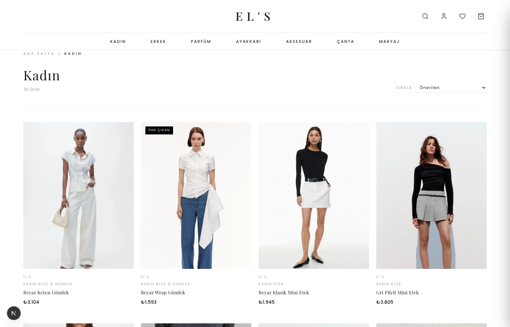
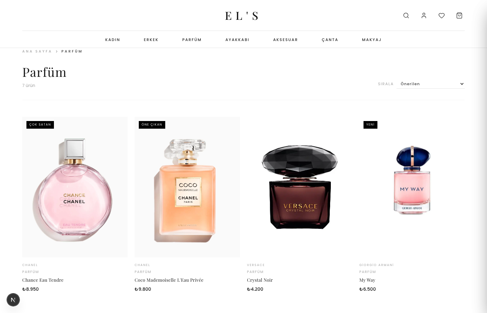
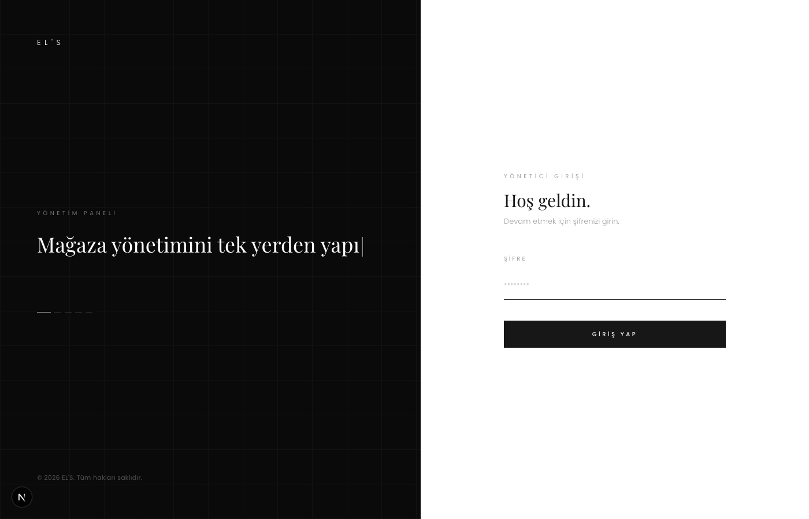
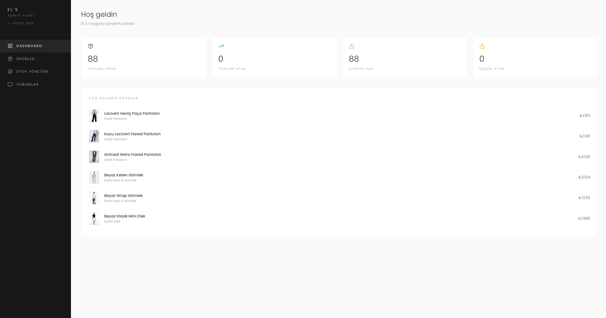
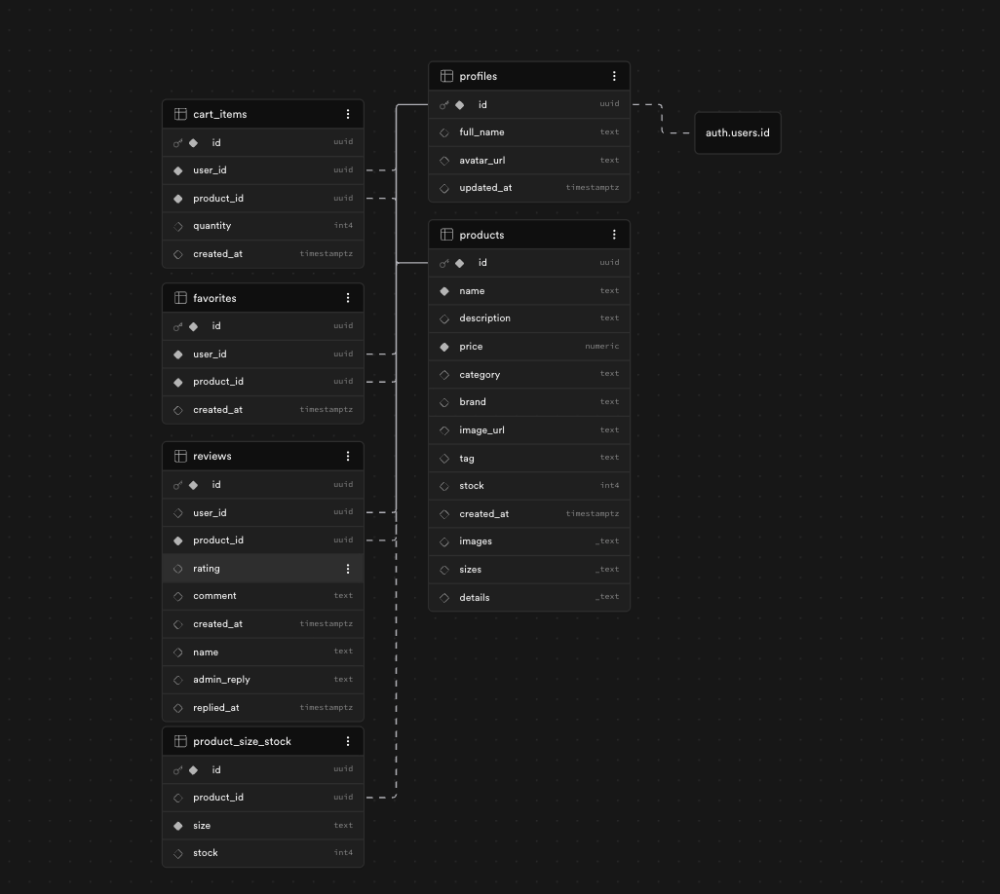

<div align="center">

# zeouf — Luxury Fashion & Lifestyle E-Commerce

**Designed and developed by [varunsidr](https://github.com/varunsidr)**

**zeouf** is a luxury fashion and lifestyle e-commerce platform designed to offer a premium online shopping experience. The platform covers a wide range of categories — women's and men's clothing, shoes, bags, accessories, perfume, and makeup — all presented with a clean, editorial aesthetic inspired by high-end fashion brands.

The project consists of two parts: a **customer-facing storefront** where users can browse collections, search products, add items to their cart, save favorites, and leave reviews; and a **password-protected admin panel** where the store owner can manage the entire product catalog, upload images, track stock, and moderate customer reviews — all from a single dashboard.

Built entirely from scratch as a personal project, zeouf combines modern web technologies with a minimalist black-and-white design language to deliver a boutique shopping experience.

</div>

---

## Screenshots

### Storefront — Home Page


### Storefront — Category Page (Women's)


### Storefront — Perfume Category


### Admin Panel — Login


### Admin Panel — Dashboard


### Database Schema (Supabase)


---

## Overview

zeouf is split into **two distinct sections**:

| Section | Path | Description |
|---|---|---|
| **Storefront** | `/` | Public-facing shop where users browse, search, favorite, and cart products |
| **Admin Panel** | `/admin` | Password-protected dashboard for managing products, reviews, and analytics |

---

## Tech Stack

| Layer | Technology |
|---|---|
| **Framework** | Next.js 16.2.1 (App Router) |
| **Language** | TypeScript 5 (strict mode) |
| **UI** | React 19, Tailwind CSS 4 |
| **Database** | Supabase (PostgreSQL) |
| **Authentication** | Supabase Auth (customers) + password-based (admin) |
| **State Management** | React Context API + localStorage |
| **Icons** | Lucide React |
| **Fonts** | Poppins, Playfair Display |
| **Deployment** | Vercel-ready |

---

## Features

### Storefront
- Category-based product listing: **Women, Men, Perfume, Shoes, Accessories, Bags, Makeup**
- Dynamic subcategories (e.g. `/kadin/elbise`, `/erkek/takim`)
- Full-text product search
- Add to cart (persisted in localStorage)
- Favorites / wishlist (synced with Supabase for signed-in users)
- Product detail page with size selection, image gallery, "Complete Your Look" cross-sell, and reviews
- Customer registration and login via Supabase Auth
- Star ratings and customer reviews
- Sale/discount banner
- Terms of Service page

### Admin Panel
- Password-protected login page
- Full product management (create, read, update, delete)
- Multiple image uploads per product
- Stock management per size
- Category assignment from a predefined list
- Customer review management + admin replies
- Analytics dashboard
- Product search and filtering

---

## Project Structure

```
els-ecommerce/
├── src/
│   ├── app/
│   │   ├── page.tsx                  # Home page
│   │   ├── layout.tsx                # Root layout
│   │   ├── admin/
│   │   │   ├── page.tsx              # Admin login
│   │   │   └── dashboard/page.tsx    # Admin dashboard
│   │   ├── kadin/[slug]/             # Women's categories
│   │   ├── erkek/[slug]/             # Men's categories
│   │   ├── ayakkabi/[slug]/          # Shoes
│   │   ├── canta/[slug]/             # Bags
│   │   ├── aksesuar/[slug]/          # Accessories
│   │   ├── parfum/[slug]/            # Perfume
│   │   ├── makyaj/[slug]/            # Makeup
│   │   ├── arama/                    # Search
│   │   └── favorilerim/              # Favorites
│   ├── components/
│   │   ├── Navbar.tsx
│   │   ├── Footer.tsx
│   │   ├── ProductCard.tsx
│   │   ├── ProductListing.tsx
│   │   ├── ProductDetailView.tsx
│   │   └── SaleBanner.tsx
│   ├── context/
│   │   ├── CartContext.tsx
│   │   └── FavoritesContext.tsx
│   ├── hooks/
│   │   ├── useFavorites.ts
│   │   └── useProductSort.ts
│   └── lib/
│       ├── supabase.ts
│       └── categories.ts
├── public/                           # Static product images
├── supabase_schema.sql               # Database schema
├── migrate-products.js               # Product seed script
├── upload-images.js                  # Image upload utility
└── update-prices.sql                 # Bulk price update SQL
```

---

## Database Schema

The database runs on **Supabase (PostgreSQL)** with Row Level Security (RLS) enabled on all tables.

```sql
-- Core tables
profiles       -- User profiles (linked to auth.users via a trigger)
products       -- Product catalog
cart_items     -- Per-user carts
favorites      -- Per-user saved products
reviews        -- Star-rated product reviews (1–5)
orders         -- Authenticated customer orders
order_items    -- Products and quantities belonging to an order
```

**RLS Policies:**
- `profiles` — users can only view and update their own profile
- `profiles` — signed-in users can create or update only their own profile
- `products` — public read access; write access via the Supabase dashboard or admin scripts
- `cart_items` — users can only access their own cart
- `favorites` — users can only access their own favorites
- `reviews` — everyone can read; only signed-in users can write; users can only edit/delete their own reviews

**Auth Trigger:**
A `profiles` row is automatically created when a new user signs up via Supabase Auth:

```sql
CREATE TRIGGER on_auth_user_created
  AFTER INSERT ON auth.users
  FOR EACH ROW EXECUTE FUNCTION public.handle_new_user();
```

The full schema lives in [supabase_schema.sql](supabase_schema.sql).

### Existing Supabase projects

If users were created before the profile trigger was installed, run
[supabase_checkout_profile_fix.sql](supabase_checkout_profile_fix.sql) once in the Supabase SQL Editor. It backfills missing profile rows and adds the self-profile insert policy required by checkout. The script is safe to run more than once.

---

## Getting Started

### Requirements

- Node.js 20.9+ (required by Next.js 16)
- npm
- A [Supabase](https://supabase.com) project (the free tier is enough)

### 1. Clone the repo

```bash
git clone https://github.com/varunsidr/els-ecommerce.git
cd els-ecommerce
```

### 2. Install dependencies

```bash
npm install
```

### 3. Configure environment variables

Copy the example file and replace every placeholder with values from your Supabase project:

```bash
cp .env.example .env.local
```

On Windows PowerShell, use `Copy-Item .env.example .env.local` instead. The public values are available in Supabase under **Project Settings → API**. Generate a long random value for `DEV_CREATE_USER_KEY`; do not reuse a Supabase key.

If the admin secret contains `#`, wrap the value in double quotes because `#` starts a dotenv comment when left unquoted:

```env
DEV_CREATE_USER_KEY="replace-with-a-long-random-admin-secret"
```

> **Note:** the storefront can render local product fallback data without Supabase, but customer authentication, reviews, uploads, admin actions, and seeded data require valid environment variables.

### 4. Set up the database

Go to your Supabase project → **SQL Editor**, paste in the contents of [supabase_schema.sql](supabase_schema.sql), and run it.

This creates all tables, enables RLS, applies the policies, and sets up the auth trigger.

### 5. Start the dev server

```bash
npm run dev
```

Open [http://localhost:3000](http://localhost:3000) to view the storefront.

### Admin access

Open `/admin` and use the value configured in `DEV_CREATE_USER_KEY`. The optional `DEV_ADMIN_USERNAME` setting can be used by custom API clients that send a username. The admin session is stored in an HttpOnly cookie; there is no default password in the repository.

### Populate admin demo data

After running `npm run seed:products`, run the following with your Supabase service-role key configured in `.env.local`:

```bash
npm run seed:admin-data
```

This creates or reuses a demo customer, three sample orders, four approved reviews, and realistic product stock. It is intended for local or demo environments only.

The dashboard calculates stock from `product_size_stock` for size-based products and from `products.stock` for products without sizes. Both values are now kept consistent so total stock and out-of-stock counts cannot describe the same inventory incorrectly.

### Local PostgreSQL with Docker

The optional Docker setup starts PostgreSQL on port `5432` and Adminer on [http://localhost:8080](http://localhost:8080):

```bash
npm run local:up
npm run seed:postgres
```

Use `npm run local:down` when finished. The local database credentials are defined in [docker-compose.yml](docker-compose.yml) and are for development only.

### Production build

```bash
npm run lint
npm run build
npm run start
```

The included GitHub Actions workflow runs the local database setup, seed, build, and health check on pushes and pull requests targeting `main`. Add these repository secrets before relying on the workflow: `NEXT_PUBLIC_SUPABASE_URL`, `NEXT_PUBLIC_SUPABASE_ANON_KEY`, and `SUPABASE_SERVICE_ROLE_KEY`.

### Demo checkout

Checkout includes a simulated card flow for portfolio and testing purposes. It never charges a card or stores card details. Use `4242 4242 4242 4242` to simulate an approved payment, or any fictional card number ending in `0002` to simulate a declined payment. Cash on delivery is also available.

---

## Testing Support Endpoints

The project provides lightweight endpoints to help automated tests (e.g. Playwright suites) manage state without touching the UI:

- `GET /api/health` — readiness check that returns `{ status: 'ok', time: '...' }`.
- `POST /api/test/reset` — protected endpoint that clears core tables and reseeds `products` using the seed data. Requires the service role key.
- `POST /api/test/seed-user` — protected endpoint that creates (or resets the password of) a fixed test user, so a test suite can log in via API and reuse a `storageState` instead of driving the UI login form every run.

Both `/api/test/*` endpoints require the `x-supabase-service-role` header to match `SUPABASE_SERVICE_ROLE_KEY`.

```bash
curl -X POST http://localhost:3000/api/test/reset \
  -H "x-supabase-service-role: $SUPABASE_SERVICE_ROLE_KEY"

curl -X POST http://localhost:3000/api/test/seed-user \
  -H "x-supabase-service-role: $SUPABASE_SERVICE_ROLE_KEY" \
  -H "Content-Type: application/json" \
  -d '{"email":"test@example.com","password":"Test1234!"}'
```

Remember: never expose `SUPABASE_SERVICE_ROLE_KEY` to client-side code or commit it to source control.

## Contributing

1. Create a feature branch.
2. Keep secrets in local or hosting-provider environment variables.
3. Run `npm run lint` and `npm run build` before opening a pull request.
4. Include a short description of user-facing changes and any required Supabase schema updates.

See [SECURITY.md](SECURITY.md) for vulnerability reporting and deployment safeguards.

## License

This project is released under the license in [LICENSE](LICENSE).

### Dev auto-create users (convenience)

For local development you can auto-create confirmed users (no verification email) using the dev-only endpoint:

- `POST /api/dev/create-user` — creates a confirmed user with `user_metadata.dev_auto = true`.
- The endpoint uses the `SUPABASE_SERVICE_ROLE_KEY` (server-side only) and will only auto-create up to 10 dev users.
- To protect the endpoint, set `DEV_CREATE_USER_KEY` in your `.env.local` and include header `x-dev-key: <DEV_CREATE_USER_KEY>` in requests.

Example (no dev key configured, local dev only):

```bash
curl -X POST http://localhost:3000/api/dev/create-user \
  -H "Content-Type: application/json" \
  -d '{"email":"dev1@example.com","password":"Dev12345!","fullName":"Dev User"}'
```

Example (with `DEV_CREATE_USER_KEY` set):

```bash
curl -X POST http://localhost:3000/api/dev/create-user \
  -H "x-dev-key: $DEV_CREATE_USER_KEY" \
  -H "Content-Type: application/json" \
  -d '{"email":"dev1@example.com","password":"Dev12345!","fullName":"Dev User"}'
```

The client-side registration form will try this endpoint first during development and fall back to the normal Supabase signup if the endpoint is unavailable.

---

## Admin Panel

The admin panel is available at `/admin`.

**Admin password:** use the value configured in `DEV_CREATE_USER_KEY`. Do not use a default password or commit this value.

> Admin login is checked server-side at `/api/admin/login`. A successful login issues an HttpOnly `admin_token` cookie for one hour; the client also keeps a small `admin_auth` flag for UI state. There is no default password in the repository.

### What you can do in the admin panel:
- Add, edit, and delete products
- Upload multiple images per product
- Set stock levels per size
- View and reply to customer reviews
- Track analytics

---

## Deployment

This project is optimized for **Vercel**:

```bash
npm run build
```

You can deploy directly using the Vercel CLI, or by connecting your GitHub repo at [vercel.com](https://vercel.com).

Don't forget to add `NEXT_PUBLIC_SUPABASE_URL` and `NEXT_PUBLIC_SUPABASE_ANON_KEY` under **Settings → Environment Variables** in your Vercel project.

---

## Environment Variables

| Variable | Required | Description |
|---|---|---|
| `NEXT_PUBLIC_SUPABASE_URL` | Yes | Your Supabase project URL (e.g. `https://xxxx.supabase.co`) |
| `NEXT_PUBLIC_SUPABASE_ANON_KEY` | Yes | Your Supabase anonymous/public API key |
| `SUPABASE_SERVICE_ROLE_KEY` | Only for test endpoints | Server-only key used by `/api/test/*` routes — never expose to the client |
| `DEV_CREATE_USER_KEY` | Admin/dev only | Password for `/admin` and protection key for the dev user endpoint; keep server-side |
| `DEV_ADMIN_USERNAME` | Optional | Username restriction for custom admin API clients; the browser admin form uses password-only login |

---

## Routing

Category routes use Turkish URL slugs (the underlying product data is Turkish), while all UI copy is in English:

| Route | Category |
|---|---|
| `/kadin` | Women |
| `/erkek` | Men |
| `/ayakkabi` | Shoes |
| `/canta` | Bags |
| `/aksesuar` | Accessories |
| `/parfum` | Perfume |
| `/makyaj` | Makeup |

---

## License

This project was designed and built by **[varunsidr](https://github.com/varunsidr)**.
All rights reserved © 2026 zeouf. See [LICENSE](LICENSE) for details.

---

<div align="center">

Made with care by [varunsidr](https://github.com/varunsidr)

</div>

---

## Before you push (quick checklist)

Follow these quick steps before creating a commit that will be pushed to a shared repo:

- **Remove secrets from working files:** Ensure `.env.local` contains only local values and is not staged. `SUPABASE_SERVICE_ROLE_KEY` must never be committed.
- **Verify `.gitignore`:** The repo ignores local env files; keep any example env files tracked instead (e.g. `.env.example`).
- **Restart dev server after env changes:** Run `npm run dev` again after editing `.env.local` so server routes pick up new keys.
- **Run lint & type checks:** `npm run lint` and `npm run build` to catch issues early.
- **Run quick functional checks:** visit `/admin`, place a demo checkout order with an authenticated user, and exercise the register/login flow. If you rely on the dev helper, test `/api/dev/create-user` with `curl`.
- **Update architecture notes:** Keep `architecture.md` in sync with any DB or API changes so reviewers understand design decisions.

If you'd like, I can run a pre-commit tidy-up (format, lint, and a small sanity test) and prepare a commit message for you.
