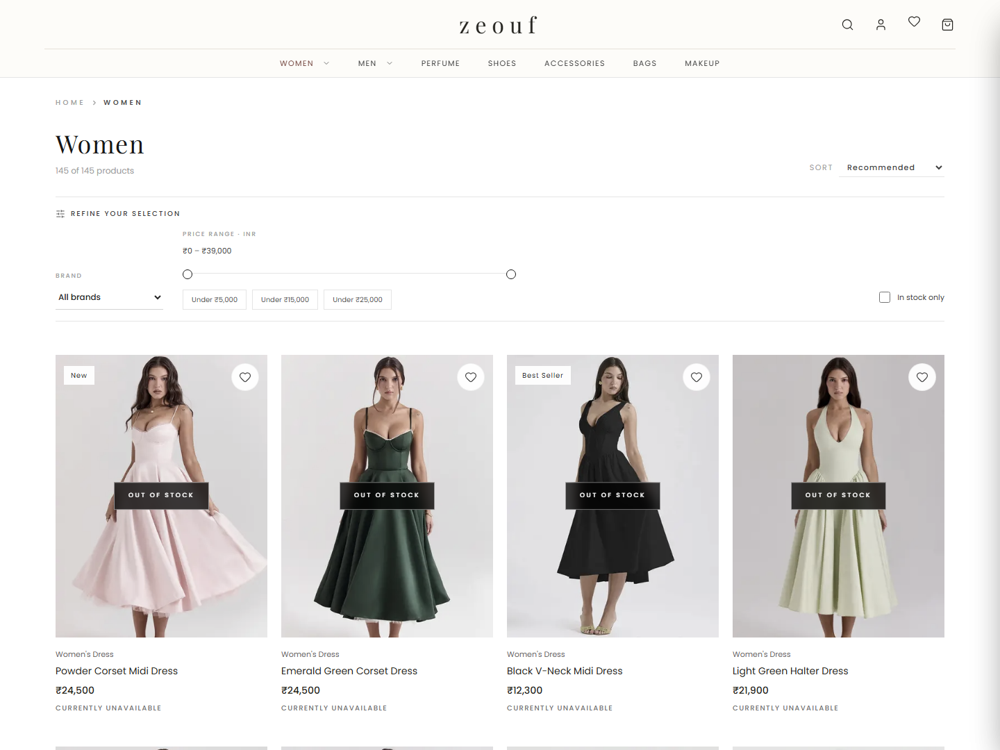
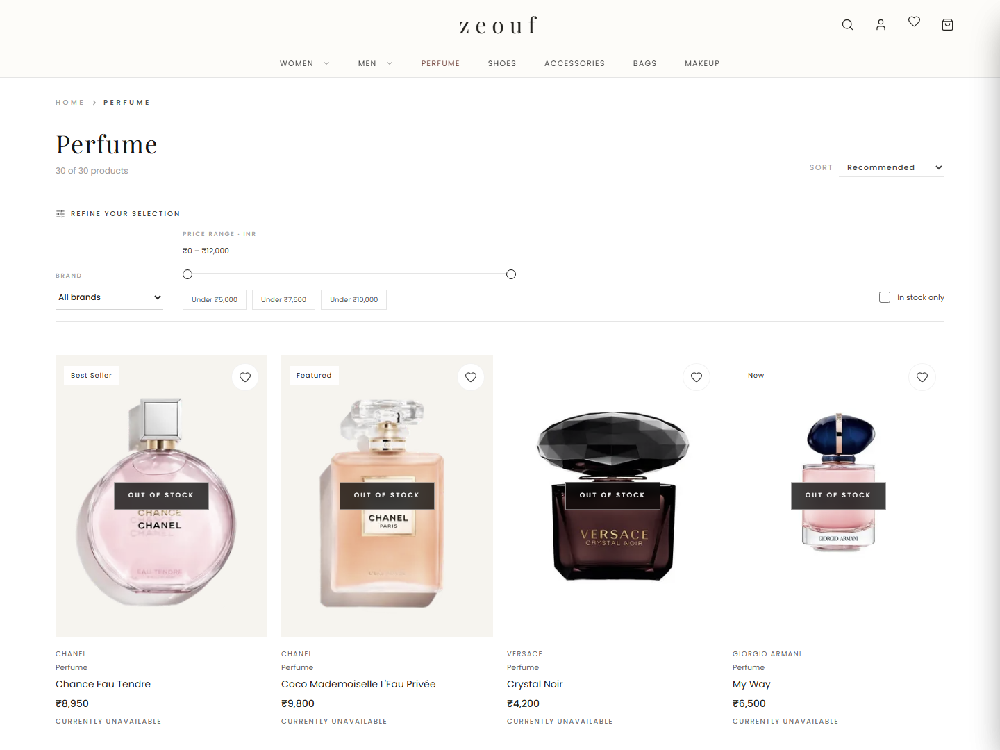
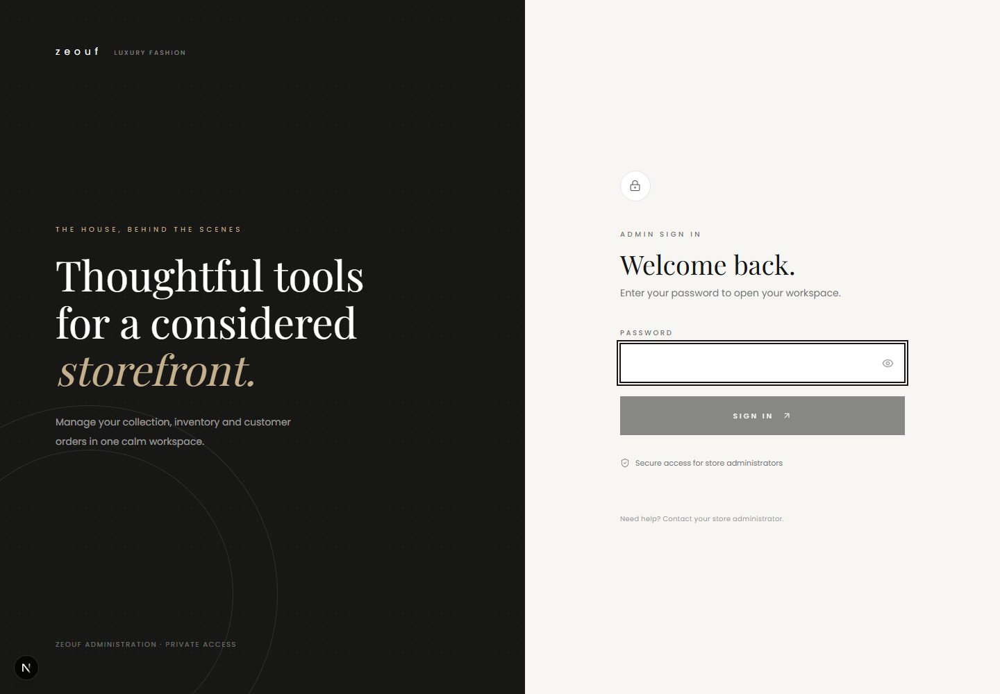
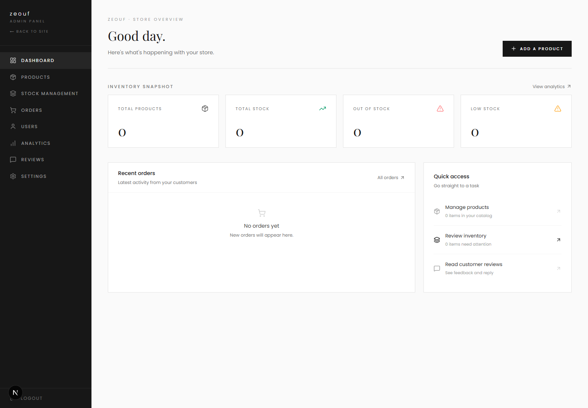
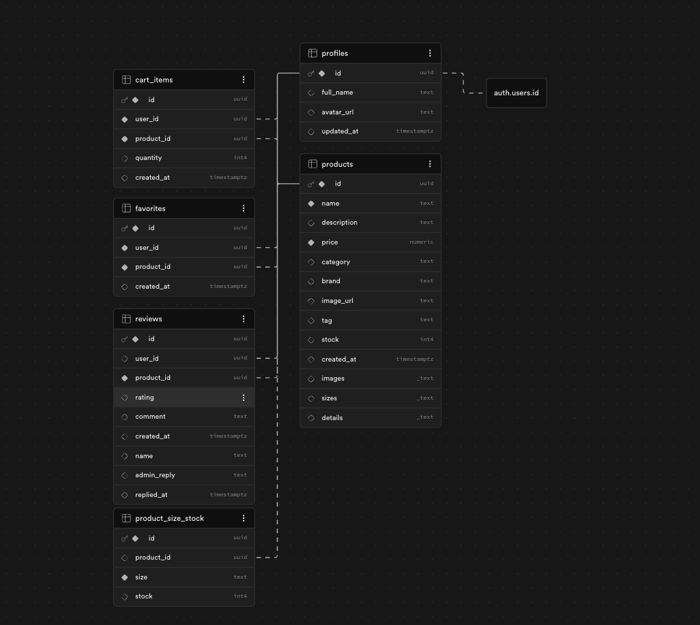

<div align="center">

# zeouf — Luxury Fashion & Lifestyle E-Commerce

**Designed and developed by [varunsidr](https://github.com/varunsidr)**

**zeouf** is a portfolio e-commerce demo for fashion and lifestyle: women's and men's clothing, shoes, bags, accessories, perfume, and makeup, presented with an editorial design.

The project includes a **customer-facing storefront** for browsing, search, accounts, carts, favorites, reviews, and simulated checkout, plus a **password-protected admin workspace** for catalog, inventory, orders, users, and analytics. Some admin write and moderation flows remain incomplete; see the [requirements and known gaps](docs/BRD.md).

Orders and payments are simulated: no payment is charged and no order is shipped. Use fictional customer details when testing.

</div>

---

## Screenshots

Captured from the current UI on 4 October 2026 at 1440px desktop width, using the local fallback catalog and INR prices. The hero uses its reduced-motion poster. The admin dashboard uses local catalog data and an empty order fixture; these previews do not demonstrate live database operations.

### Storefront — Home Page


<details>
<summary>View the complete homepage</summary>


</details>

### Storefront — Category Page (Women's)


### Storefront — Perfume Category


### Admin Panel — Login


### Admin Panel — Dashboard


### New demo catalog photography

The 280 demo additions currently use low-resolution crops from generated contact sheets. Some crops contain neighboring image edges, so these assets need individual high-resolution replacements before production use. Here are a few examples:

<table>
  <tr>
    <td align="center"><br><sub>Women’s dresses</sub></td>
    <td align="center"><br><sub>Women’s blouses</sub></td>
    <td align="center"><br><sub>Men’s suits</sub></td>
    <td align="center"><br><sub>Perfume</sub></td>
  </tr>
  <tr>
    <td align="center"><br><sub>Shoes</sub></td>
    <td align="center"><br><sub>Bags</sub></td>
    <td align="center"><br><sub>Accessories</sub></td>
    <td align="center"><br><sub>Makeup</sub></td>
  </tr>
</table>

---

## Overview

zeouf is split into **two distinct sections**:

| Section | Path | Description |
|---|---|---|
| **Storefront** | `/` | Public-facing shop where users browse, search, favorite, and cart products |
| **Admin Panel** | `/admin` | Password-protected dashboard for managing products, reviews, and analytics |

---

## Tech Stack

| Layer | Technology |
|---|---|
| **Framework** | Next.js 16.2.1 (App Router) |
| **Language** | TypeScript 5 (strict mode) |
| **UI** | React 19, Tailwind CSS 4 |
| **Database** | Supabase (PostgreSQL) |
| **Authentication** | Supabase Auth (customers) + password-based (admin) |
| **State Management** | React Context API + localStorage |
| **Icons** | Lucide React |
| **Fonts** | Poppins, Playfair Display |
| **Deployment** | Vercel-ready |

---

## Features

### Storefront
- Category-based product listing: **Women, Men, Perfume, Shoes, Accessories, Bags, Makeup**
- Dynamic subcategories (e.g. `/women/dress`, `/men/suits`)
- Case-insensitive product name/category substring search
- Signed-in add to bag, with validated localStorage restoration and recovery feedback; the cart is shared across accounts in the same browser
- Favorites / wishlist (synced with Supabase for signed-in users)
- Product detail page with size selection, image gallery, "Complete Your Look" cross-sell, and reviews
- Color swatches for products with verified color-specific photography
- Email restock alerts for unavailable items and sizes
- Customer registration with password confirmation and login via Supabase Auth; password recovery completion remains pending
- Star ratings and customer reviews
- Editorial homepage with manual hero navigation, pause controls, and reduced-motion support
- Privacy and Terms of Service pages

### Admin Panel
- Password-protected login page
- Catalog listing and add/edit/delete forms; browser writes still require a completed admin authorization path
- Product image URL/upload controls; working uploads require storage permissions
- Stock management per size
- Category assignment from a predefined list
- Review listing and a separate pending-review moderation page; unified moderation and visible reply controls remain pending
- Analytics dashboard
- Product search and filtering

Implementation limits and acceptance criteria are tracked in [docs/BRD.md](docs/BRD.md), rather than inferred from screenshots.

---

## Project Structure

```
Luxury_fashion_ecommerce/
├── src/
│   ├── app/
│   │   ├── page.tsx                  # Home page
│   │   ├── layout.tsx                # Root layout
│   │   ├── admin/
│   │   │   ├── page.tsx              # Admin login
│   │   │   └── dashboard/page.tsx    # Admin dashboard
│   │   ├── kadin/[slug]/             # Women's categories
│   │   ├── erkek/[slug]/             # Men's categories
│   │   ├── ayakkabi/[slug]/          # Shoes
│   │   ├── canta/[slug]/             # Bags
│   │   ├── aksesuar/[slug]/          # Accessories
│   │   ├── parfum/[slug]/            # Perfume
│   │   ├── makyaj/[slug]/            # Makeup
│   │   ├── arama/                    # Search
│   │   └── favorilerim/              # Favorites
│   ├── components/
│   │   ├── Navbar.tsx
│   │   ├── Footer.tsx
│   │   ├── ProductCard.tsx
│   │   ├── ProductListing.tsx
│   │   ├── ProductDetailView.tsx
│   │   └── SaleBanner.tsx
│   ├── context/
│   │   ├── CartContext.tsx
│   │   └── FavoritesContext.tsx
│   ├── hooks/
│   │   ├── useFavorites.ts
│   │   └── useProductSort.ts
│   └── lib/
│       ├── supabase.ts
│       └── categories.ts
├── public/                           # Static product images
├── supabase_schema.sql               # Database schema
├── migrate-products.js               # Product seed script
├── upload-images.js                  # Image upload utility
└── update-prices.sql                 # Bulk price update SQL
```

The App Router retains legacy Turkish directory names. Public URLs use the [English routes](#routing) below; `next.config.ts` provides compatibility mappings. The storefront cart uses `src/lib/cartStorage.ts` and localStorage, not the `cart_items` table. Browser regressions live in `tests/` with configuration in `playwright.config.ts`; business and QA documentation lives in `docs/`.

---

## Database Schema

The database runs on **Supabase (PostgreSQL)** with Row Level Security (RLS) enabled on all tables.

```sql
-- Core tables
profiles       -- User profiles (linked to auth.users via a trigger)
products       -- Product catalog
cart_items     -- Per-user cart schema (not used by the current storefront)
favorites      -- Per-user saved products
reviews        -- Star-rated product reviews (1–5)
orders         -- Authenticated customer orders
order_items    -- Products and quantities belonging to an order
```

**RLS Policies:**
- `profiles` — signed-in users can view, create, and update only their own profile
- `products` — public read access; write access via the Supabase dashboard or admin scripts
- `cart_items` — users can only access their own cart
- `favorites` — users can only access their own favorites
- `reviews` — everyone can read; only signed-in users can write; users can only edit/delete their own reviews

**Auth Trigger:**
A `profiles` row is automatically created when a new user signs up via Supabase Auth:

```sql
CREATE TRIGGER on_auth_user_created
  AFTER INSERT ON auth.users
  FOR EACH ROW EXECUTE FUNCTION public.handle_new_user();
```

Apply these SQL files in order in a dedicated Supabase demo project:

1. [supabase_schema.sql](supabase_schema.sql) — base tables, policies, and profile trigger.
2. [supabase_reviews_migration.sql](supabase_reviews_migration.sql) — review fields and policies.
3. [supabase_demo_catalog_migration.sql](supabase_demo_catalog_migration.sql) — size inventory, color/order option fields, and private restock requests.
4. [supabase_checkout_security_migration.sql](supabase_checkout_security_migration.sql) — remove direct customer order-insert policies.
5. [supabase_checkout_transaction_migration.sql](supabase_checkout_transaction_migration.sql) — install the transaction called by server-side checkout.

Policies and schema do not resolve all current moderation/admin-write gaps; consult the BRD before treating the demo as a production store.

<details>
<summary>Historical Supabase schema screenshot</summary>

This older diagram predates the checkout/restock migrations and is incomplete. The SQL files above are the source of truth.



</details>

### Existing Supabase projects

If users were created before the profile trigger was installed, run
[supabase_checkout_profile_fix.sql](supabase_checkout_profile_fix.sql) once in the Supabase SQL Editor. It backfills missing profile rows and adds the self-profile insert policy required by checkout. The script is safe to run more than once.

---

## Getting Started

### Requirements

- Node.js 20.9+ (required by Next.js 16)
- npm
- A [Supabase](https://supabase.com) project for authentication and database-backed features; fallback browsing works without one

### 1. Clone the repo

```bash
git clone https://github.com/varunsidr/Luxury_fashion_ecommerce.git
cd Luxury_fashion_ecommerce
```

### 2. Install dependencies

```bash
npm ci
```

### 3. Configure environment variables

Copy the example file, replace the Supabase placeholders with your project values, and generate separate admin and test secrets. Leave optional mail settings empty until configured:

```bash
cp .env.example .env.local
```

On Windows PowerShell, use `Copy-Item .env.example .env.local` instead. The public values are available in Supabase under **Project Settings → API**. Generate a long random value for `DEV_CREATE_USER_KEY`; do not reuse a Supabase key.

If the admin secret contains `#`, wrap the value in double quotes because `#` starts a dotenv comment when left unquoted:

```env
DEV_CREATE_USER_KEY="replace-with-a-long-random-admin-secret"
```

> **Note:** the storefront can render local product fallback data without Supabase, but customer authentication, reviews, uploads, admin actions, and seeded data require valid environment variables.

### 4. Set up the database

Go to your Supabase project → **SQL Editor** and apply the files listed under [Database Schema](#database-schema) in order. Checkout needs the service-role key and checkout transaction migration as well as the base tables.

### 5. Start the dev server

```bash
npm run dev
```

Open [http://localhost:3000](http://localhost:3000) to view the storefront.

### Admin access

Open `/admin` and use the value configured in `DEV_CREATE_USER_KEY`. The optional `DEV_ADMIN_USERNAME` setting can be used by custom API clients that send a username. The admin session is stored in an HttpOnly cookie; there is no default password in the repository.

### Populate admin demo data

After applying the demo catalog migration, run `npm run seed:products` to add 20 new demo items per existing product category. The 280 products use generated contact-sheet crops in `public/demo-products/`; prices and inventory are demo values. The seed skips existing product names and removes incorrect color variants from previously seeded demo rows without changing their stock. Then run the following with your Supabase service-role key configured in `.env.local`:

```bash
npm run seed:admin-data
```

The admin-data seed creates or reuses a demo customer, three sample orders, four approved reviews, and demo product stock. It is intended for local or demo environments only.

To deliver restock alerts, configure `RESEND_API_KEY` and a verified `RESTOCK_FROM_EMAIL`. Requests can be saved without mail delivery. A positive admin stock save may trigger a notification batch; zero-to-positive transition checks, recipient eligibility, and retry/deduplication remain incomplete (G-12).

The dashboard calculates stock from `product_size_stock` for sized products and from `products.stock` otherwise. Concurrent inventory writes and size edits still have documented consistency limits (G-18).

### Local PostgreSQL with Docker

The optional Docker setup starts PostgreSQL on port `5432` and Adminer on [http://localhost:8080](http://localhost:8080):

```bash
npm run local:up
docker compose exec -T db psql -U postgres -d els_ecommerce_local < scripts/ci_products_schema.sql
npm run seed:postgres
```

For the schema step in PowerShell, use `Get-Content scripts/ci_products_schema.sql -Raw | docker compose exec -T db psql -U postgres -d els_ecommerce_local`. This is a minimal local product schema for seeding/CI, separate from the Supabase application schema and authentication.

Use `npm run local:down` when finished. The local database credentials are defined in [docker-compose.yml](docker-compose.yml) and are for development only.

### Production build

```bash
npm run lint
npm run build
npm run start
```

GitHub Actions checks requirements documentation, local PostgreSQL seed/build/health, and isolated Chromium regressions on pushes and pull requests targeting `main`. These workflows use local fixtures and do not require live Supabase secrets or prove live database integration.

### Browser and documentation checks

```bash
npx playwright install chromium
npm run test:ui
npm run test:catalog
npm run docs:test
npm run docs:check
```

Each browser suite launches its own localhost:3100 server with live Supabase/mail disabled and a separate `.next-browser-tests` cache. Run them sequentially. The catalog suite intercepts a reserved `.invalid` fixture domain to exercise configured-client loading, timeout, fallback, and retry states without a live database. See [docs/QA_TESTING_GUIDE.md](docs/QA_TESTING_GUIDE.md) for fixtures, coverage, and remaining manual checks.

### Demo checkout

Checkout offers a demo card method and simulated cash on delivery. It has no card-number fields or approval/decline-number rules, never charges a payment, and ships nothing. A signed-in customer submits fictional contact/address details; successful checkout saves a demo order and reduces demo inventory. The card method adds a short simulated processing delay.

---

## Testing Support Endpoints

The project provides lightweight endpoints to help automated tests (e.g. Playwright suites) manage state without touching the UI:

- `GET /api/health` — application liveness response `{ status: 'ok', time: '...' }`; it does not check database readiness.
- `POST /api/test/reset` — protected endpoint that attempts to clear favorites/cart/reviews/products and reseed products. Requires the service role key; it omits orders/browser storage and does not establish a completely clean fixture (G-23).
- `POST /api/test/seed-user` — protected endpoint that creates (or resets the password of) a fixed test user, so a test suite can log in via API and reuse a `storageState` instead of driving the UI login form every run.

Both `/api/test/*` endpoints are disabled in production. In local development they require `x-test-api-secret` to match the separate `TEST_API_SECRET` environment variable. The service role key stays on the server and is never used as an HTTP credential.

```bash
curl -X POST http://localhost:3000/api/test/reset \
  -H "x-test-api-secret: $TEST_API_SECRET"

curl -X POST http://localhost:3000/api/test/seed-user \
  -H "x-test-api-secret: $TEST_API_SECRET" \
  -H "Content-Type: application/json" \
  -d '{"email":"test@example.com","password":"Test1234!"}'
```

Remember: never expose `SUPABASE_SERVICE_ROLE_KEY` to client-side code or commit it to source control.

## Contributing

1. Create a feature branch.
2. Keep secrets in local or hosting-provider environment variables.
3. Run `npm run lint` and `npm run build` before opening a pull request.
4. Include a short description of user-facing changes and any required Supabase schema updates.

For source/documentation changes, follow [AGENTS.md](AGENTS.md): inspect affected BRD requirements and QA scenarios, run `npm run docs:sync`, record a descriptive `npm run docs:review` with the actual affected IDs, then run `npm run docs:check`. Commit the generated sheet, history, review log, and source snapshot together.

See [SECURITY.md](SECURITY.md) for vulnerability reporting and deployment safeguards.

### Dev auto-create users (convenience)

For local development you can auto-create confirmed users (no verification email) using the dev-only endpoint:

- `POST /api/dev/create-user` — creates a confirmed user with `user_metadata.dev_auto = true`.
- The endpoint uses the `SUPABASE_SERVICE_ROLE_KEY` (server-side only) and will only auto-create up to 10 dev users.
- To protect the endpoint, set `DEV_CREATE_USER_KEY` in your `.env.local` and include header `x-dev-key: <DEV_CREATE_USER_KEY>` in requests.

Example (no dev key configured, local dev only):

```bash
curl -X POST http://localhost:3000/api/dev/create-user \
  -H "Content-Type: application/json" \
  -d '{"email":"dev1@example.com","password":"Dev12345!","fullName":"Dev User"}'
```

Example (with `DEV_CREATE_USER_KEY` set):

```bash
curl -X POST http://localhost:3000/api/dev/create-user \
  -H "x-dev-key: $DEV_CREATE_USER_KEY" \
  -H "Content-Type: application/json" \
  -d '{"email":"dev1@example.com","password":"Dev12345!","fullName":"Dev User"}'
```

The client-side registration form will try this endpoint first during development and fall back to the normal Supabase signup if the endpoint is unavailable.

---

## Admin Panel

The admin panel is available at `/admin`.

**Admin password:** use the value configured in `DEV_CREATE_USER_KEY`. Do not use a default password or commit this value.

> Admin login is checked server-side at `/api/admin/login`. A successful login issues an HttpOnly `admin_token` cookie for one hour; the client also keeps a small `admin_auth` flag for UI state. There is no default password in the repository.

The workspace exposes catalog forms, image controls, size-based stock, order status updates, users, reviews, and analytics. Catalog writes and review replies have the limitations listed under [Features](#features) and in the BRD. Sidebar logout clears the browser's signed cookie before returning to `/admin`; failed requests offer retry feedback.

---

## Deployment

This project is optimized for **Vercel**:

```bash
npm run build
```

You can deploy directly using the Vercel CLI, or by connecting your GitHub repo at [vercel.com](https://vercel.com).

Configure the public Supabase settings and the server-only values required by the enabled features under **Settings → Environment Variables**. Checkout/private admin APIs need `SUPABASE_SERVICE_ROLE_KEY`; admin login needs `DEV_CREATE_USER_KEY`. Keep test helpers disabled in production and mail settings optional.

---

## Environment Variables

| Variable | Required | Description |
|---|---|---|
| `NEXT_PUBLIC_SUPABASE_URL` | Yes | Your Supabase project URL (e.g. `https://xxxx.supabase.co`) |
| `NEXT_PUBLIC_SUPABASE_ANON_KEY` | Yes | Your Supabase anonymous/public API key |
| `SUPABASE_SERVICE_ROLE_KEY` | For server-backed features | Server-only key for checkout, private admin APIs, restock requests/delivery, seeds and dev/test helpers — never expose to the client |
| `DEV_CREATE_USER_KEY` | Admin/dev only | Password for `/admin` and protection key for the dev user endpoint; keep server-side |
| `DEV_ADMIN_USERNAME` | Optional | Username restriction for custom admin API clients; the browser admin form uses password-only login |
| `RESEND_API_KEY` | Optional | Resend API key used to deliver restock alerts |
| `RESTOCK_FROM_EMAIL` | Optional | Verified sender address for Resend restock alerts |
| `NEXT_PUBLIC_SITE_URL` | For configured site links | Storefront origin used in configured email links; set the deployed URL for hosted environments |
| `TEST_API_SECRET` | Local test helpers only | Separate secret for `x-test-api-secret`; test helpers are disabled in production |
| `DATABASE_URL` | Local PostgreSQL seeds only | Development PostgreSQL connection string; the storefront uses Supabase or fallback data |

---

## Routing

The storefront uses English copy and English URLs. Legacy Turkish category URLs redirect to the English equivalents:

| Route | Category |
|---|---|
| `/women` | Women |
| `/men` | Men |
| `/shoes` | Shoes |
| `/bags` | Bags |
| `/accessories` | Accessories |
| `/perfume` | Perfume |
| `/makeup` | Makeup |

---

## License

This project was designed and built by **[varunsidr](https://github.com/varunsidr)**.
All rights reserved © 2026 zeouf. See [LICENSE](LICENSE) for details.

---

<div align="center">

Made with care by [varunsidr](https://github.com/varunsidr)

</div>

---

## Before you push (quick checklist)

Follow these quick steps before creating a commit that will be pushed to a shared repo:

- **Keep secrets out of commits:** Store local configuration in untracked `.env.local`; never stage it or commit `SUPABASE_SERVICE_ROLE_KEY`.
- **Verify `.gitignore`:** The repo ignores local env files; keep any example env files tracked instead (e.g. `.env.example`).
- **Restart dev server after env changes:** Run `npm run dev` again after editing `.env.local` so server routes pick up new keys.
- **Run lint & type checks:** `npm run lint` and `npm run build` to catch issues early.
- **Run quick functional checks:** visit `/admin`, place a demo checkout order with an authenticated user, and exercise the register/login flow. If you rely on the dev helper, test `/api/dev/create-user` with `curl`.
- **Update architecture notes:** Keep `architecture.md` in sync with any DB or API changes so reviewers understand design decisions.
- **Review requirements:** Update the BRD/QA guide, run `docs:sync`, record `docs:review` with affected IDs, and pass `docs:check`; preserve existing test execution history.
