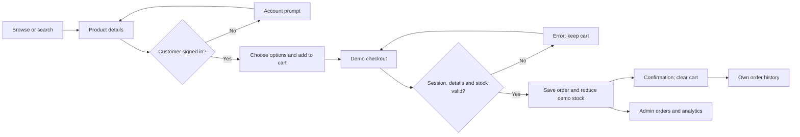

# zeouf website — Business Requirements Document

| Document control | Value |
|---|---|
| Version | 1.9 |
| Prepared | 2 October 2026 |
| Product | zeouf — Luxury Fashion & Lifestyle |
| Baseline | Working copy based on f370094, reviewed 11 October 2026 for protected admin catalog writes, atomic inventory synchronization, dashboard actions/metrics/errors and the current read-only security inspector. Snapshot/review log identify exact inputs. |
| Status | Draft for business and QA review; no stakeholder sign-off recorded |
| Audience | Customers, product owner, administrators, developers, manual testers, and test-generation tools |
| Evidence | Source inspection and scoped local SQL/API/browser/build evidence are recorded separately in the QA guide. Existing assistant live-fixture smoke is historical. No full acceptance, applied live catalog migration, real storage upload, complete live security inspection or multi-session concurrency is established. |

## Contents

1. [Purpose and business objectives](#1-purpose-and-business-objectives)
2. [Scope and feature overview](#2-scope-and-feature-overview)
3. [Roles and permissions](#3-roles-and-permissions)
4. [Website pages and navigation](#4-website-pages-and-navigation)
5. [User journeys](#5-user-journeys)
6. [Functional requirements](#6-functional-requirements)
7. [Business rules and validation](#7-business-rules-and-validation)
8. [Data and persistence](#8-data-and-persistence)
9. [Integrations and API inventory](#9-integrations-and-api-inventory)
10. [Nonfunctional requirements](#10-nonfunctional-requirements)
11. [Dependencies and environment readiness](#11-dependencies-and-environment-readiness)
12. [Known gaps and business decisions](#12-known-gaps-and-business-decisions)
13. [Testing and acceptance](#13-testing-and-acceptance)
14. [Source index](#14-source-index)
15. [Glossary and sign-off](#15-glossary-and-sign-off)

## 1. Purpose and business objectives

This document explains what the website does, who can use each function, the rules behind those functions, and what testers should check. Each requirement has a stable ID so test cases, defects, and release decisions can refer to the same functionality.

zeouf presents a luxury fashion and lifestyle catalog across women, men, perfume, shoes, accessories, bags, and makeup. Customers can discover products, select options, save favorites, and place demonstration orders. Administrators can inspect store activity and use the available catalog, inventory, order, and moderation tools.

**The current product is a portfolio demonstration.** Checkout saves demo orders and changes demo inventory when configured, but does not charge money or arrange delivery. Business acceptance must preserve that distinction in customer-facing copy.

| Objective | Business outcome | Suggested measure, pending owner approval |
|---|---|---|
| BO-01: Product discovery | Customers find suitable products through categories, search, and filters. | All published navigation paths resolve; discovery tests cover every category. |
| BO-02: Understand products | Customers see prices, photographs, sizes, stock, and relevant product information. | Product-option and availability requirements have traceable passing tests. |
| BO-03: Save shopping intent | Signed-in customers manage favorites and a browser-persisted cart. | Favorites remain account-specific; cart totals match selected variants and quantities. |
| BO-04: Demonstrate ordering | Customers place a complete demo order using trusted prices and available stock. | Both payment choices pass; failed transactions leave no partial order or stock change. |
| BO-05: Operate the catalog | Administrators inspect inventory, orders, customer profiles, and feedback. | Admin acceptance tests distinguish available actions from incomplete controls. |
| BO-06: Speed up QA | Testers generate cases from an explicit feature and rule inventory. | Every requirement has linked tests or a documented exclusion/blocker. |

No conversion, sales, traffic, uptime, or speed target has been supplied. Suggested quality targets below are proposals, not measured results or agreed service commitments.

## 2. Scope and feature overview

| Area | What the user can understand or do | Current boundary |
|---|---|---|
| Home and navigation | Browse one active campaign video or still poster, editorial collection links, seven category links, account, search, favorites, and cart. | Campaign content is defined in code; media pauses offscreen, in hidden tabs, on explicit pause, or for reduced motion. |
| Catalog | Browse seven main categories, clothing subcategories and highlights; filter, sort, and load more. | Listings can fall back to a local catalog. |
| Search | Search product names and category text. | Case-insensitive substring search; no relevance engine, suggestions, or full-text index established. |
| Product details | Inspect photographs, verified color options, size choices, quantity, size guide, information panels, related products, and reviews; share product-specific page metadata. | Demo-image products hide color choices; some descriptive content uses generic fallback copy; shipping text always reflects demo limits. |
| Account | Register with matching password confirmation, sign in, sign out, reveal password, request a reset email. | Completion of password recovery is incomplete. |
| Favorites | Save/remove products and see saved products and counts. | Requires a customer session and database. |
| Cart | Restore validated saved lines, recover malformed data, add chosen options, change quantities, remove lines, see totals, proceed to checkout. | Adding requires sign-in; cart stays browser-wide. Unavailable storage permits in-memory use with feedback. |
| Checkout | Enter contact/address details, choose demo card or simulated cash on delivery, save an order with an attempt key and retry unchanged details safely. | Requires purchase safeguards migration; no card fields, actual charges, tax/shipping calculation, or delivery integration. |
| Order history | Read one's own orders and expand product lines. | No customer cancellation, refunds, tracking number, or reorder action. |
| Reviews | Submit stars/comments and optional images; read feedback and stored replies. | Public approval behavior and reply/schema support have gaps. |
| Restock alerts | Save an email request; administrator stock updates can trigger email; unsubscribe through a token link. | Delivery is optional and batch-limited; notification eligibility has gaps. |
| Admin | Login, dashboard, products, stock, orders, users, analytics, reviews, settings. | Some catalog writes lack checked-in admin permissions; some controls are informational or incomplete. |
| Information pages | Read terms, privacy notice, and portfolio/demo explanations. | They do not establish a commercial store policy or operational fulfillment service. |
| Newsletter | Read preview limits before entering an email-shaped value and trying the preview UI. | No subscription record or email is sent. |
| Shopping assistant | Open a floating chat panel on non-admin pages, ask catalog/policy questions and confirm proposed bag additions. | Requires server model configuration; tools read cached catalog data, verified-session cart input is browser supplied, and availability/confirmation limits remain G-26. No checkout/order/account tools. |
| QA utilities | Application health, protected nonproduction reset/user setup, development user creation, schema text. | QA utilities are not customer features; reset is not a proven complete clean-up. |

**Outside the current scope:** real payment gateways; guest checkout; shipping/carrier fulfillment; invoices; tax calculation; coupon/discount engine; returns/refunds workflow; customer profile/address editing; social login/MFA; product comparison; localization beyond existing English presentation and legacy URL compatibility; admin roles/audit logs; full newsletter delivery; exports; editable store settings; independent color inventory. These must not be generated as implemented acceptance tests. Future work needs separate requirements and approval of scope.

## 3. Roles and permissions

| Capability | Visitor | Signed-in customer | Administrator |
|---|---|---|---|
| Home, catalog, search, product information, public information pages | Yes | Yes | Can visit storefront |
| Read reviews | Yes, under present read policy | Yes | Yes |
| Add products to cart | Opens account prompt | Yes | Only with a separate customer session |
| View/edit existing browser cart | Existing local cart may be visible | Yes | Browser-state dependent |
| Add/remove favorites | Opens account prompt | Own favorites | No administrator impersonation flow |
| Submit review or upload review images | No | Yes | Separate customer session required |
| Save restock email request/unsubscribe with token | Yes | Yes | Yes |
| Place demo order | No | Yes | Separate customer session required |
| Read customer order history | Sign-in message | Own orders only | Admin order API can read all orders |
| Admin dashboard/product/stock/order/user/review areas | Login required by intended design | Customer login grants no admin rights | Separate admin credential/cookie; known permission gaps below |
| Protected QA helper APIs | No ordinary access | No ordinary access | Separate nonproduction test secret; admin cookie is insufficient |

An admin session uses its own signed cookie. It is not a Supabase customer identity or database role. A local `admin_auth` flag drives navigation but must not be treated as authorization.

## 4. Website pages and navigation

### Public pages

| Route / entry point | Function | Key links / access |
|---|---|---|
| `/` | Home: women/men hero with pause/manual controls, seven-category navigation, two collection panels, six editorial tiles, blouse edit and demo explanation | Editorial links lead to category/listing pages. One active local video replaces multiple simultaneous videos and the third-party closing embed. |
| `/women`, `/men` | All products for a clothing main category | Subcategory/highlight mega menus and mobile navigation |
| `/perfume`, `/shoes`, `/accessories`, `/bags`, `/makeup` | Remaining main-category listings | Main navigation/footer |
| `/women/dress`, `/women/blouse`, `/women/jacket`, `/women/skirt`, `/women/trousers` | Clothing subcategories | Catalog and mega menu |
| `/men/suits`, `/men/shirts`, `/men/trousers`, `/men/jacket` | Clothing subcategories | Catalog and mega menu |
| `/women/new-arrivals`, `/women/best-sellers`, `/women/collection` | Women's highlight collections | Tag-derived highlights; collection is the main category |
| `/men/new-arrivals`, `/men/best-sellers`, `/men/collection` | Men's highlight collections | Same rules as women |
| `/{main-category}/{product-id}` | Product details | Product card image/name; identifiers are normally database UUIDs |
| `/search?q={encoded-query}` | Search results | Header search overlay |
| `/favorites` | Saved product list | Header/footer favorite links |
| `/checkout` | Demo order form, summary, then confirmation | Cart drawer; authenticated submission |
| `/orders` | Customer order history | Account panel; own session |
| `/privacy`, `/terms` | Demo privacy information and terms | Footer/account links; return-home links |
| Account panel | Sign in/register/reset-email request and signed-in order-history/sign-out controls | Header icon or gated action; no dedicated account URL |
| Shopping assistant panel | Non-modal catalog/policy chat and proposed add-to-bag confirmation | Floating launcher on non-admin pages; no dedicated page URL; POST /api/assistant |
| Cart drawer | Browser cart, quantity/removal controls and checkout link | Header cart icon or successful add |
| Size guide overlay | XS–L chest/waist reference | Product detail size-guide button |

English URLs are rewrites to existing Turkish-named source directories. Legacy `/kadin`, `/erkek`, `/parfum`, `/ayakkabi`, `/canta`, `/aksesuar`, `/makyaj`, `/arama`, `/favorilerim`, and `/kullanim-kosullari` redirect permanently to their English equivalents. Specific legacy clothing slugs also translate, e.g. `/kadin/elbise` to `/women/dress`. Test redirects as navigation, not as separate duplicate features. Unrecognized product/subcategory values should produce the framework not-found page. Product helpers also support numeric local fixture IDs and attempt slug lookup; a database `slug` column is not part of the base schema.

### Administrator pages

| Entry | Function / route behavior |
|---|---|
| `/admin` | Username/password browser login; production uses named hash entries |
| `/admin/dashboard` | Inventory snapshot, five recent orders, quick-access links |
| `/admin/products` | Catalog table, name search, category filter, add/edit/delete form |
| Stock Management sidebar item | Stock editing within `AdminApp`; no standalone `/admin/stock` page exists |
| `/admin/orders` | Search/filter orders; open detail modal; change status |
| `/admin/users` | Profile list; View control currently has no action |
| `/admin/analytics` | Order, inventory, top-product, and review summaries |
| `/admin/reviews` entered directly | Separate server-rendered pending-review page with approve/delete forms |
| Reviews sidebar item within `AdminApp` | Different, read-only all-review list; no visible reply/approve/delete controls |
| `/admin/settings` | Read-only store/catalog/database summary |

Sidebar navigation changes component state, not the browser URL. A refresh restores the page associated with the route originally opened. The storefront header/footer are omitted on admin pages.

## 5. User journeys

| Journey | Preconditions | Main flow | Result / exceptions | Requirements |
|---|---|---|---|---|
| J-01 Discover and inspect | Visitor; local or configured catalog | Home → category/subcategory → filters/sort/load more → card → product detail | Matching products or empty state; unsupported ID gives not-found | NAV-01–07, CAT-01–08, PDP-01–06 |
| J-02 Find by search | Visitor | Open search → enter query → submit → results → product | Name/category substring matches, deduplicated; blank header search stays put | SEA-01–03, PDP-01 |
| J-03 Create/use account | Auth configured | Account → Register → matching password/confirmation → submit → verification if configured → Sign In | Session activates customer features; validation/provider errors stay in account panel | AUTH-01–07 |
| J-04 Save for later | Customer signed in | Heart on card/detail → favorites page → remove heart | Account-specific favorites/count update; visitor gets prompt | FAV-01–03 |
| J-05 Build cart | Customer; purchasable product | Select size/color if offered → quantity → add → drawer → edit/remove → refresh | Variant lines persist in this browser; inventory rechecked at checkout | PDP-03–04, CART-01–06 |
| J-06 Place demo order | Customer; nonempty cart; server/database ready | Checkout → all shipping fields → demo method → submit → confirmation → history | One pending demo order, trusted price snapshot, inventory reduction, cleared cart; failure keeps cart and the attempt key for unchanged retries | CHK-01–10, ORD-01–03 |
| J-07 Leave feedback | Customer; review schema/storage ready | Detail → name/stars/comment → optional images → submit | Optimistic item then saved record or rollback/error; moderation visibility unresolved | REV-01–07 |
| J-08 Get restock notice | Unavailable item/size; alert database ready | Email request → pending subscription → admin adds stock → optional email → unsubscribe | Duplicate pending request reused; missing mail config saves request; eligibility/UI gaps apply | RST-01–05, STK-01–04 |
| J-09 Maintain products | Admin session and write permissions | Admin → Products → create/edit/images/sizes → stock view → publish through saved data | Database permission and size synchronization gaps can block intended save | ADM-01–04, PRD-01–06, STK-01–04 |
| J-10 Operate store | Admin session; orders/reviews exist | Dashboard → orders → status update → analytics; direct reviews route → moderation | Customers see changed status on reload; cancellation does not restore stock | AOR-01–04, ANL-01–05, REV-05–07 |

## 6. Functional requirements

### How to read the requirement tables

**State:** `I` = behavior present in inspected source; `C` = present but depends on configured services/schema/permissions; `D` = deliberate demo/preview behavior; `P` = partial or inconsistent implementation; `T` = proposed target without complete implementation. None of these states means a test has passed. For P/T rows, acceptance text states intended behavior and names the gap; generate target tests with an explicit known-gap label. For I/C/D rows, acceptance text describes the source baseline.

**Priority:** P0 = access/data/order integrity; P1 = core customer/admin function; P2 = secondary presentation or convenience. These are suggested QA priorities, pending owner review. Source codes resolve in section 14. The CSV mirrors these rows and leaves execution/test-link fields open.

The catalogue contains 126 requirements across 20 modules (including nonfunctional requirements), with **26 source-level gap findings** tracked in section 12.

### 6.1 Home, navigation, and routes

| ID | Priority | State | Requirement and acceptance criteria | Source | QA focus |
|---|---|---|---|---|---|
| NAV-01 | P1 | I | Home shall show women/men hero content and matching links, with one active local video or still poster, manual slide selection and pause/play. Automatic change occurs about every six seconds while at least 10% visible, tab visible, unpaused and reduced motion disabled. Offscreen/hidden/paused media stops; reduced motion uses still imagery and manual selection. | HOME | Active-only playback, posters, manual selection, pause, offscreen/hidden tab, reduced motion |
| NAV-02 | P1 | I | Two collection panels, seven category links, six editorial tiles and the blouse edit shall navigate to configured category/subcategory destinations. The compact homepage uses consistent typography/spacing and explicit demo copy; editorial tiles remain curated category links. | HOME | Every CTA/destination, 375/768/1440 widths, image loading |
| NAV-03 | P1 | I | Desktop navigation shall expose seven categories and women's/men's subcategory/highlight menus, with pointer hover and keyboard-operable expanded-state disclosure controls. Escape closes menus; closed menu links are inert. | NAV, CATDEF | Hover, disclosure click/Enter, Escape, inert links, current route |
| NAV-04 | P1 | I | Mobile navigation shall open/close, expose seven category links and expandable women's/men's clothing/highlight sections, and close after navigation or Escape. | NAV | Touch, narrow screen, subcategories, dismissal and focus restoration |
| NAV-05 | P1 | I | Header shall expose account, search, favorites and cart; logo returns home. Active account/cart/search/mobile dialogs lock background scrolling, contain keyboard focus, and support Escape/close/backdrop dismissal with focus restoration; closed drawers are inert. | NAV, SHELL | Dialog roles, Tab/Shift+Tab, Escape, counts, scroll lock, focus restoration |
| NAV-06 | P1 | I | English URLs and their legacy redirects/rewrites shall resolve to the intended page, including mapped legacy clothing slugs. | ROUTE | Direct URL, encoded query, redirect destination |
| NAV-07 | P1 | I | Unknown product/subcategory routes shall reach not-found; storefront chrome shall be absent from admin pages. | ROUTE, DETAILROUTE, SHELL | Missing ID, route refresh, admin layout |

### 6.2 Catalog listing

| ID | Priority | State | Requirement and acceptance criteria | Source | QA focus |
|---|---|---|---|---|---|
| CAT-01 | P1 | I | Listings shall restrict products to the selected category/subcategory using configured English categories and normalized matching; women's and men's collections remain distinct. | LIST, CATDEF | All 14 database categories, alias/normalization cases |
| CAT-02 | P1 | I | New Arrivals shall match tags containing new; Best Sellers shall match best/featured/populer tags; Collection shall include the main category. No sales ranking is implied. | LIST | Tags, main-category boundary, English/legacy slugs |
| CAT-03 | P1 | I | Brand and size filters shall use distinct values in the current collection and combine with other selected filters; missing option groups shall not show unusable selectors. | LIST | Single and combined filters, missing metadata |
| CAT-04 | P1 | I | Price filters shall apply inclusive displayed-currency min/max bounds through two sliders and suggested Under tiers; sliders shall not cross; currency changes clear price bounds. | LIST, CURRENCY | Boundary prices, tier rounding, currency change |
| CAT-05 | P1 | I | In stock only shall keep unsized products with positive stock and sized products with available size stock; selected size shall constrain availability when stock rows exist. | LIST | Stock 0/1, mixed sizes, missing size rows |
| CAT-06 | P1 | I | Sort shall offer Recommended, Price Low to High, Price High to Low, and New Arrivals; listing price ties use name; New Arrivals prioritizes new tags then date then name. Recommended retains incoming order. | LIST | Equal price/date, missing date/tag |
| CAT-07 | P1 | I | Listing shall initially reveal at most 24 matches and load 24 more per click; count shall say Showing {visible} of {matching} products, following filters and the final batch. Pending requests show Loading collection, distinct from genuine empty collections and no-filter-match results. | LIST | Pending request, 0/1/24/25/48/49 products, count text, final batch, filter reset, clear all |
| CAT-08 | P1 | I | Listing shall use local products when Supabase is unconfigured or product fetch fails. Configured product and stock operations each have an eight-second deadline and cancel on cleanup. Product failure/timeout shows identified demo fallback and Retry collection; stock-only failure/timeout retains live products with availability warning and retry. Successful retry clears feedback; a successful empty product response stays empty. Fallback browsing does not establish working order/auth services. | LIST, DBCLIENT, CATREQUEST | Product/stock slow, error and empty responses; timeout, cancellation, retry, genuine empty versus demo fallback |

### 6.3 Search

| ID | Priority | State | Requirement and acceptance criteria | Source | QA focus |
|---|---|---|---|---|---|
| SEA-01 | P1 | I | Header search shall focus its field, trim input, ignore empty submission, encode the query, close the search UI and navigate to /search?q=…. | NAV | Spaces, ampersand, Unicode, keyboard submit |
| SEA-02 | P1 | I | Results shall combine case-insensitive name and category substring queries and deduplicate by product ID. | SEARCH, DBCLIENT | Name-only/category-only/both matches, case, no matches |
| SEA-03 | P2 | P | Search shall show loading, query/count, results, and no-results states; explicit service-error/retry handling and clearing old results for a blank query are incomplete (G-15). | SEARCH | Slow/error responses, rapid query changes, blank after valid query |

### 6.4 Product cards and details

| ID | Priority | State | Requirement and acceptance criteria | Source | QA focus |
|---|---|---|---|---|---|
| PDP-01 | P1 | I | Cards/detail shall present name, price, image, optional brand/tag/category and product links; detail uses applicable gallery thumbnails. Cards use consistent crops and responsive image sizes, show loading placeholders, and retain readable product information with Image unavailable feedback after photo failure. | CARD, DETAIL | Single/multiple/missing images, supported remote host, loading/failure state |
| PDP-02 | P1 | I | Verified color options shall expose named swatches and applicable images; selected color accompanies cart line. Products under /demo-products/ shall hide colors and use one demo photograph. | CARD, DETAIL | Color/image correspondence, no-color/demo fixtures |
| PDP-03 | P0 | P | Sized products shall require a chosen available size before add; zero or missing stock rows disable the size. Detail initializes from supplied size_stock then refreshes database rows; the local fallback supplies fixture rows. All-sold-out fixtures expose a whole-product restock form and disable purchase. Selecting a specific unavailable size for an alert remains unresolved (G-09). | DETAIL, DBCLIENT, SEED | No size, zero/missing row, mixed/all-zero stock, initial versus refreshed rows, unavailable-size alert gap |
| PDP-04 | P1 | I | Detail quantity shall start at one, not decrease below one, clamp to known positive available stock, and disable add/increase when the known limit is reached. | DETAIL | 1, stock limit, size change, unknown stock |
| PDP-05 | P2 | I | Size guide shall open/close and show XS/S/M/L chest and waist references; it is a static clothing reference, not a product-specific shoe or XL/XXL guide. | DETAIL | Overlay dismissal and reference values |
| PDP-06 | P2 | I | Detail shall offer one-open-at-a-time information panels for details, measurements, composition/care/origin, and shipping/exchanges/returns. Product information uses supplied text or generic fallback; shipping content always states no charge, shipment, exchanges, returns or support follow-up and asks for fictional details, overriding any product shipping promises. | DETAIL | Open/switch/close, newline content, defaults, supplied shipping promises cannot override demo limits |
| PDP-07 | P2 | I | Complete Your Look shall show up to eight other products whose category starts with the main category; the current product is excluded and an empty related section is hidden. | DETAIL | 0/1/8 related items, links, horizontal scroll |
| PDP-08 | P1 | I | In-stock unsized cards shall allow Add to bag; sized cards link to size selection; out-of-stock cards display unavailable status and omit purchase controls. Actions are visible on touch layouts and reveal on hover or keyboard focus on desktop; favorite controls remain visible with pressed state. | CARD | Sized/unsized/out-of-stock, guest prompt, touch/keyboard/hover actions |
| PDP-09 | P2 | I | Dynamic routes in all seven category families shall generate product-specific titles identifying name/category with the root zeouf suffix, demo descriptions and Open Graph title/description/image when supplied. Recognized clothing subcategories get collection metadata; missing products request no indexing/following. Product lookup is memoized within a server render. Metadata does not enforce category-path ownership (G-08). | PRODUCTMETA, DETAILROUTE, DBCLIENT, SHELL | Seven product families, collection slugs, absent product, Open Graph values, category-path gap |

### 6.5 Currency and pricing display

| ID | Priority | State | Requirement and acceptance criteria | Source | QA focus |
|---|---|---|---|---|---|
| CUR-01 | P1 | C | Storefront shall select USD for detected US country and INR for other countries; country headers take precedence over browser fallback (India time zone, America time zone, US language). | CURRENCY, REGION | Header precedence, absent country, browser fallbacks |
| CUR-02 | P1 | C | USD display shall convert base INR through a valid positive rate, round to whole displayed units and use en-US formatting; INR uses rate one and en-IN. Rate fetch failure shall fall back to INR. | CURRENCY, REGION | Invalid/zero rate, network failure, rounding |
| CUR-03 | P0 | I | Cart/detail/history shall use shared currency formatting; stored prices/order totals and admin monetary displays remain base INR. Conversion is presentation and does not establish USD settlement. | CURRENCY, CART, CHECKOUT, HISTORY, ADMIN | Base versus displayed totals, rate-dependent historical display |

### 6.6 Customer account

| ID | Priority | State | Requirement and acceptance criteria | Source | QA focus |
|---|---|---|---|---|---|
| AUTH-01 | P1 | C | Register shall collect required full name/email/password and call Supabase signup with name metadata; success switches to Sign In and explains email verification when applicable. | NAV, SCHEMA | Required/email validation, duplicate signup, provider policy |
| AUTH-02 | P0 | I | Controlled password confirmation shall match the exact password before either development helper or Supabase signup. Blank confirmation is required; mismatch shows an alert and makes no create request. Confirmation clears on successful registration or account-tab change and is not sent to the provider. | NAV | Equal/unequal/blank confirmation, reveal toggle, request absence/payload, tab change |
| AUTH-03 | P0 | C | Sign In shall authenticate email/password, display failure, show loading, and close account panel on session success; protected customer actions become available. | NAV | Valid/wrong/unverified/expired account, repeat submit |
| AUTH-04 | P1 | I | Password visibility shall toggle in account forms without changing the entered password; Sign In/Register tabs shall be available. | NAV | Toggle, switch tab, stale feedback |
| AUTH-05 | P1 | P | Forgot Password shall require entered email and request a reset email; a complete new-password recovery screen/session handler is absent (G-02). | NAV | No email, provider error, reset link and recovery completion |
| AUTH-06 | P0 | C | Sign Out shall end customer session and clear in-memory favorites through auth updates; local cart currently remains. | NAV, FAV, CART | Reload, protected actions, account switch/cart boundary |
| AUTH-07 | P1 | C | Development registration may first try confirmed-user creation; on failure/unavailability it shall fall back to normal signup. Production helper shall be disabled. | NAV, DEVUSER | Protected helper failure, normal signup, production |

### 6.7 Favorites

| ID | Priority | State | Requirement and acceptance criteria | Source | QA focus |
|---|---|---|---|---|---|
| FAV-01 | P1 | C | Signed-in customers shall toggle a product favorite from card/detail; stored user/product pair is unique and successful changes update icon/count. | FAV, CARD, DETAIL, SCHEMA | Toggle/add/remove, duplicate click, failed write |
| FAV-02 | P0 | C | Favorites shall load for the current user and clear on sign-out; one customer must not read/change another customer's favorites. | FAV, SCHEMA | Two-account isolation, reload, direct database access |
| FAV-03 | P1 | C | Favorites page shall display saved product cards/count, loading, and empty Discover Collection link; visitors attempting to favorite shall get an account prompt. | FAVORITESPAGE, FAV, NAV | Empty/deleted product, guest prompt, card navigation |

### 6.8 Cart

| ID | Priority | State | Requirement and acceptance criteria | Source | QA focus |
|---|---|---|---|---|---|
| CART-01 | P0 | I | Add shall require a customer session; a visitor receives an account prompt without addition; successful add opens drawer. The interrupted action is not automatically replayed after login. | CART, NAV | Guest/customer, post-login retry |
| CART-02 | P1 | I | Lines shall be identified by product ID + size + color; missing/empty/null options normalize to null. Matching tuples merge quantities and differing options create distinct lines, including recovered legacy lines. | CART, CARTSTORE | Same/different options, null/missing color, repeated add, legacy restoration |
| CART-03 | P1 | I | Drawer shall show image/name/options/quantity/line total; plus/minus updates quantity; a quantity below one or explicit remove deletes the line. | CART, NAV | Remove at one, variant-specific deletion, total changes |
| CART-04 | P0 | P | Browser cart shall restore before writing els-cart. Malformed JSON/nonarrays recover to empty; invalid lines are removed while valid lines remain, with recovery feedback. Restored lines require nonempty display fields, supported photo URLs, finite nonnegative numeric prices, positive safe-integer quantities and valid options. Read/write storage failures keep an in-memory bag with a persistence notice. Account separation/sign-out clearing remain unresolved (G-10); no cart_items synchronization exists. | CART, CARTSTORE, NAV | Initial load/reload, mixed invalid rows, duplicate variants, unavailable/quota-limited storage, two accounts |
| CART-05 | P1 | I | Item badge equals sum of quantities; base subtotal equals sum of stored line price × quantity, displayed through currency formatter. Checkout determines authoritative current prices. | CART, NAV, CHECKOUT | Multiple lines, rounding, changed database price |
| CART-06 | P1 | I | Empty drawer shall show Start Shopping; nonempty drawer shall show Proceed to Checkout and close when navigating; cart UI currently has no upper quantity cap. | NAV, CART | Empty/nonempty, close, quantity above API limit |

### 6.9 Demo checkout

| ID | Priority | State | Requirement and acceptance criteria | Source | QA focus |
|---|---|---|---|---|---|
| CHK-01 | P0 | C | Order submission shall require valid customer bearer token and nonempty cart; UI disables guest/empty submission and API rejects invalid/expired sessions. | CHECKOUT, CHECKOUTUI | Guest, expired token, forged user ID, empty cart |
| CHK-02 | P1 | C | All five shipping fields shall be nonempty after server trimming: full name, phone, address, city, postal code; current server truncation limits in section 7 apply. | CHECKOUT, CHECKOUTUI | Missing/whitespace fields, limits, numeric-looking strings |
| CHK-03 | P0 | C | Request shall contain 1–50 raw item entries with strict UUID product IDs and integer quantities 1–20 after Number conversion; duplicate tuples merge and merged quantity above 20 fails. Nonstring or oversized size/color values fail before the transaction. | CHECKOUT | 0/1/50/51 lines, invalid UUID, quantity 0/1/20/21/fraction, duplicates, option type/length |
| CHK-04 | P1 | D | Checkout shall offer demo card and simulated cash on delivery, clearly state no charge/delivery, and collect/send no card details. Card adds a roughly 1.2-second simulation delay and is labelled Simulated successful payment; no charge; no decline branch exists. Historical G-11 is retained. | CHECKOUTUI, CHECKOUT, PROJECTDOCS | Both methods, request payload, no card details or approval/decline claim |
| CHK-05 | P0 | C | The authoritative database transaction shall use current database price snapshots and available inventory, ignoring browser-supplied prices/totals. Sized products require configured size stock; colors share that stock. There is no separate API inventory precheck. | CHECKOUT, PURCHASEMIG | Price tampering, stale price, removed product, missing stock row |
| CHK-06 | P0 | C | A new successful transaction shall create one pending order and all lines with quantity, unit price, size/color; decrement inventory and set total to sum of snapshots. Sized totals sum only currently configured size rows; obsolete rows do not inflate stock. | CHECKOUT, PURCHASEMIG | Sized/unsized/multi-line transactions, shared color stock, stale size rows |
| CHK-07 | P0 | C | Insufficient stock in the transaction shall return 409; failure shall leave no partial order/lines/attempt record or stock decrement. Product rows are locked in UUID order before writes, with guarded decrements. Competing orders must not oversell; multi-session concurrency remains unverified by the single-connection local suite. | CHECKOUT, PURCHASEMIG, PURCHASETEST | Last unit concurrency, crossed multi-product orders, later-line rollback, DB failure |
| CHK-08 | P1 | C | On successful returned order ID, UI shall clear cart and show demo confirmation/ID and Continue Shopping with no delivery/email/support promises. API failure, malformed response or network rejection shall show error, keep cart and release submitting state for retry. A synchronous guard prevents overlapping UI submissions. | CHECKOUTUI | Success, error/malformed response, network rejection, repeated click, state retention |
| CHK-09 | P0 | C | Purchase safeguards transaction shall enforce configured size and color: sized products require a listed size; unsized products reject size; non-demo products with color options require a listed color; demo-photo/no-color products reject color. A UUID Idempotency-Key is required. The same customer/key/normalized payload returns the original order and total before stock checks; changed payload returns 409 without writes. Different customers cannot replay each other's order. Applied/live behavior remains unverified (G-08, G-14). | CHECKOUT, PURCHASEMIG, PURCHASETEST | Missing/invented option, absent/malformed key, exact replay after depletion, changed items/address/payment, cross-customer keys |
| CHK-10 | P0 | I | Browser checkout shall retain a random attempt UUID and SHA-256 digest of customer/items/address/method under zeouf-checkout-attempt in sessionStorage, storing no raw contact fields there. Same details after a lost response/reload reuse the key; changed fingerprint generates a new key. Success removes it; unavailable storage permits in-memory retry only. Reload requires re-entering the same form details, and a new tab/session is not a guaranteed replay. | CHECKOUTUI, UITEST | Both methods, lost response/reload, unchanged/changed details, account switch, blocked storage, success cleanup, no raw contact storage |

### 6.10 Customer orders

| ID | Priority | State | Requirement and acceptance criteria | Source | QA focus |
|---|---|---|---|---|---|
| ORD-01 | P0 | C | Customers shall retrieve only their own orders, newest first, including order lines; guest, loading, error and no-order states shall be distinct. | HISTORY, SCHEMA, CHECKOUTSEC | Two-account ownership, direct reads, empty/error |
| ORD-02 | P1 | C | Order cards shall show short ID, date, formatted total and demo status; expanding one order shows product/image, quantity, line total and demo payment label, including Simulated cash on delivery. Introductory copy states no charge or delivery. | HISTORY | Expand/collapse, deleted product fallback, all statuses, demo copy/payment labels |
| ORD-03 | P1 | P | Selected size/color shall remain stored and should be visible in history/admin detail; the current views retrieve them but omit presentation (G-07). | HISTORY, ADMIN, DEMOMIG | Variant persistence versus rendered detail |

### 6.11 Reviews and moderation

| ID | Priority | State | Requirement and acceptance criteria | Source | QA focus |
|---|---|---|---|---|---|
| REV-01 | P1 | P | Review form requires nonblank displayed name/comment and stars; it sends a customer bearer token to the server review route, which stores a pending product/user/rating/comment and optional owned image URLs. Displayed name is still omitted from storage (G-03). | DETAIL, REVIEWSAPI, SECURITYMIG | Missing fields, guest, rating 1/5, returned anonymous name, direct DB write denial |
| REV-02 | P1 | I | Review upload accepts 1–3 JPEG/PNG/WebP files of 1 byte–2 MiB each for an authenticated user and existing product, checks file signatures, and limits each account to 10 upload requests per day. New files use the private review-images bucket created by the hardening migration; moderators use ten-minute signed URLs. Historical public files and orphan cleanup remain open. | DETAIL, REVIEWUPLOAD, MODPAGE, SECURITYMIG, RATELIMIT | File count/size/signature, forged MIME, invalid token/product, account limit, private bucket, signed URL expiry |
| REV-03 | P1 | I | Submission keeps form data during upload/save, shows an error on failure, and clears it only after server creation. A successful pending review is acknowledged as awaiting approval and is not placed in the public list. | DETAIL, REVIEWSAPI | Successful pending response, upload/API/network failure, retry/data retention |
| REV-04 | P0 | I | Public review API and detail query show approved rows only; database SELECT allows approved reviews or the author's own pending rows, and customer review writes are revoked. Server creation forces pending. Applied-policy/live visibility remains to be verified (G-04). | DETAIL, REVIEWSAPI, SCHEMA, REVIEWMIG, SECURITYMIG | Visitor/customer pending visibility, direct INSERT/UPDATE/DELETE denial, approval tampering, rating consistency |
| REV-05 | P1 | C | Direct /admin/reviews shall list pending reviews and let a cookie-authenticated admin approve/delete; approval records moderation time and updates database approved aggregates. | MODPAGE, MODAPI, SCHEMA | Valid/expired admin, approval/deletion, pending empty state |
| REV-06 | P1 | P | Admin sidebar retrieves all reviews through the cookie-protected API and remains read-only; the separate pending page has moderation actions, and form results return JSON (G-05). Navigation/return flow remains incomplete. | ADMIN, MODPAGE, MODAPI | Both entry paths, signed-cookie all-review list, form submission and return flow |
| REV-07 | P1 | P | Admin shall be able to save/remove a reply and customers shall read persisted reply text; helper functions exist without visible reply controls and reply columns are missing from supplied schema/migrations (G-03, G-05). | ADMIN, DETAIL, SCHEMA, REVIEWMIG | No false success, reply persistence, public display |

### 6.12 Restock alerts

| ID | Priority | State | Requirement and acceptance criteria | Source | QA focus |
|---|---|---|---|---|---|
| RST-01 | P1 | C | Available alert UI shall accept email for an unavailable item/selected size and save product/email/size/color without customer authentication; invalid email/product shall fail. Specific unavailable-size selection is a UI gap (G-09). | DETAIL, RESTOCK | Guest, whole-product versus size request, invalid product/email |
| RST-02 | P1 | C | Email shall be trimmed/lowercased; duplicate pending product/email/size/color requests shall return already_subscribed; otherwise create one pending record and token. | RESTOCK, DEMOMIG | Case, null options, concurrent duplicate uniqueness |
| RST-03 | P1 | C | Response/UI shall distinguish saved-with-mail-enabled from saved-with-mail-disabled; absent delivery configuration shall keep pending requests. | RESTOCK, DETAIL, NOTIFY | Mail on/off, missing database, queued response |
| RST-04 | P0 | P | Admin positive stock save can trigger up to 100 pending product requests, filtering by size when supplied, and mark successful sends notified; true stock/transition checks, retry scheduling and robust deduplication are incomplete (G-12). | ADMIN, NOTIFY | Size eligibility, provider failure, repeated/concurrent batches |
| RST-05 | P1 | C | GET/POST token unsubscribe shall delete the matching alert and return plain confirmation; malformed token fails, well-formed already-removed token is still successful; public clients cannot directly read the alert table. | UNSUB, DEMOMIG | Valid/repeated/malformed token, privacy/RLS |

### 6.13 Admin access and dashboard

| ID | Priority | State | Requirement and acceptance criteria | Source | QA focus |
|---|---|---|---|---|---|
| ADM-01 | P0 | I | Production admin login requires a named account with its scrypt password hash and a distinct session-signing secret; it issues a one-hour HttpOnly/SameSite=Lax cookie, Secure in production. The browser collects username/password; nonproduction may use the legacy dev key. MFA and live credential provisioning remain open. | ADMINLOGIN, ADMINAUTH, RATELIMIT | Wrong username/password, missing production config, cookie claims/attributes, legacy key denied in production, MFA gap |
| ADM-02 | P0 | P | Admin catalog reads/saves/deletes/uploads shall require a signed admin cookie independent of the local UI flag; server service-role writes use validated routes and same-origin mutation guards. Migration restricts browser catalog/image writes. Unwired review-reply helpers still lack an admin server workflow (G-06); applied live permissions remain unverified. | ADMIN, ADMINAUTH, ADMINAPIS, ADMINCAT, SCHEMA | Forged/expired/customer cookies, cross-site writes, storage/RPC privileges, remaining reply workflow |
| ADM-03 | P0 | C | Sidebar logout shall POST the cookie-clearing endpoint and wait for success before removing the local flag and replacing the route with /admin. Failed requests preserve the session and display retry feedback. After successful logout the same browser's protected APIs deny access. This clears the browser cookie; copied signed tokens retain their original expiry. | ADMIN, ADMINLOGOUT | Cookie/flag after sidebar logout, API rejection, request failure/retry, endpoint contracts |
| ADM-04 | P1 | C | Dashboard shall show product/configured-stock/out-of-stock/low-stock counts including unsized low stock, up to five newest orders, inventory warning and quick links. Refresh/retry shall reload catalog/stock and orders; failed/loading inventory metrics show an unavailable dash and failed order reads do not show a successful empty state. Add a product shall open its form. | ADMIN, ADMINCAT, ADMINAPIS | Known sized/unsized counts, newest five, failed reads versus empty, refresh, working Add product |
| ADM-05 | P1 | C | Dashboard shall show a pending-order count linking to the pending queue and active demo order value excluding cancelled orders, with explicit no-payment-collected copy. Failed/loading order metrics show an unavailable dash. | ADMIN, ADMINAPIS, ADMINCAT | Pending-queue navigation, mixed status/value fixtures, unavailable states, demo copy |

### 6.14 Admin product management

| ID | Priority | State | Requirement and acceptance criteria | Source | QA focus |
|---|---|---|---|---|---|
| PRD-01 | P1 | C | Admin product table shall load products with configured size rows through signed-cookie GET /api/admin/products, newest first, and combine case-insensitive name search with exact category filter. Failed reads show actionable feedback rather than a successful empty catalog. | ADMIN, ADMINCAT | Cookie/503 failures, search/category/no matches, nested inventory, refresh |
| PRD-02 | P1 | C | Add/edit shall persist validated name/category/price/description/sizes/main image/image list through server-only catalog routes and save_admin_product. Initial unsized stock can be supplied on create; existing quantities are changed only on Stock Management. Failed writes keep the form and values, release saving state and show a safe error. | ADMIN, ADMINCAT | Create/edit/reload, denied writes, retained fields, retry, stale metadata form versus checkout |
| PRD-03 | P0 | C | Server product saves shall require a trimmed name of 1-200 characters, configured category, finite numeric price 0 to less than 10000000000 with at most two decimals, numeric integer stock 0-2147483647, description at most 10000 characters, unique configured sizes and at most 12 image URLs. Images accept local root paths or HTTPS on the configured Supabase origin, never executable/protocol-relative URLs. JSON body above 50000 JavaScript characters gives 413. Database price/stock checks enforce future writes; NOT VALID preserves legacy rows for explicit inspection/repair (G-17). | ADMIN, ADMINCAT | NaN/string/negative/fraction/overflow, duplicate/unknown size/category, URL/malformed/body boundaries, legacy invalid rows |
| PRD-04 | P1 | C | Product image upload shall use signed-cookie, same-origin server POST /api/admin/products/upload with shared limit 10/admin/minute; choose one 1-byte to 2-MiB JPEG/PNG/WebP file with matching signature. Declared Content-Length above 3 MiB gives 413. Server generates a UUID path in public product-images; storage bucket has matching size/type limits and restrictive browser-write guards. Upload failures show feedback; Save/Upload are disabled during upload. Removing a URL or abandoning a form does not delete stored objects. | ADMIN, ADMINCAT | Anonymous/cross-site denial, size/type/signature, failed upload, public URL, max images, signature-not-full-decode and multipart limits |
| PRD-05 | P1 | C | Atomic catalog save shall lock the parent product before size rows, preserving retained-size quantities, inserting new configured sizes at zero, deleting removed/obsolete rows and deriving sized total from current rows. Client overall stock cannot override a sized total or an existing unsized quantity. Removing all sizes starts unsized stock at zero. This shares checkout/stock lock order; live multi-session verification and separate seed-insert repair remain G-18. | ADMIN, ADMINCAT, PURCHASEMIG, PURCHASETEST | Retain/add/remove/missing/obsolete rows, sized-to-unsized, stale form after depletion, forced rollback, live concurrency |
| PRD-06 | P1 | C | Delete shall require browser confirmation and signed-cookie server DELETE /api/admin/products/[id]. Missing product gives 404; failed writes show feedback and retain the list. Database cascades dependent favorite/review/size/alert rows; historical order lines retain price/quantity with null product. Stored image files are not garbage-collected. | ADMIN, ADMINCAT, SCHEMA, DEMOMIG | Cancel/confirm, missing ID, denial/error, referenced product/history snapshots, image retention |

### 6.15 Admin stock

| ID | Priority | State | Requirement and acceptance criteria | Source | QA focus |
|---|---|---|---|---|---|
| STK-01 | P0 | C | Stock view shall expose one row per configured size or one Overall row for unsized products. Whole-number nonnegative edits save on blur through protected stock PATCH; failed writes/invalid values show feedback and do not update in-memory stock. Positive saves may still trigger notifications with G-12 limits. | ADMIN, STOCKAPI | Sized/unsized, blur, invalid/failing write, expired cookie, notification limits |
| STK-02 | P0 | C | Cookie-protected stock API shall require a strict UUID and Number-converted integer stock 0–2147483647, rejecting nonstring nonnull sizes. set_product_stock shall lock the product, validate size membership, upsert the size and sum only configured rows, or set unsized overall stock. Unknown product returns 404; invalid option 400; absent service config 503; RPC/migration failure 500. | STOCKAPI, PURCHASEMIG | 0/1/4/5, negative/fraction/overflow, invalid UUID/type, unknown product, missing/existing/stale row |
| STK-03 | P1 | I | Row labels shall be Out of stock for zero, Low stock for 1-4, Available for 5+. Dashboard and analytics low-stock counts include unsized products with 1-4 units and sized products with at least one configured size in that range. | ADMIN | 0/1/4/5, unsized low stock, configured size versus obsolete rows |
| STK-04 | P0 | C | Purchase stock RPC and atomic catalog save shall use parent-product-first locking with checkout. Stock RPC rejects unsupported size or overall edits on sized products; catalog save synchronizes configured rows/totals and preserves current existing unsized stock. Local rollback/permission tests are scoped evidence; separate seeding and live multi-session behavior remain G-18. | STOCKAPI, PURCHASEMIG, ADMINCAT, ADMIN, PURCHASETEST | Transaction failure, checkout/edit concurrency, configured aggregate, stale form, seed-repair limitation |

### 6.16 Admin orders and users

| ID | Priority | State | Requirement and acceptance criteria | Source | QA focus |
|---|---|---|---|---|---|
| AOR-01 | P0 | C | Admin shall retrieve orders/lines newest first through authenticated API; table shall show ID/customer ID/INR total/status/date and View action. | ADMIN, ADMINAPIS | All versus own orders, expired cookie, retrieval failure |
| AOR-02 | P1 | I | Order search shall match order ID or customer ID case-insensitively and combine with exact status filter, distinguishing no orders from no matches. | ADMIN | Partial ID, casing, all five statuses |
| AOR-03 | P1 | C | View shall open order detail with product/quantity/line totals/order total and status selector; valid status updates persist and appear in customer history on reload. | ADMIN, ADMINAPIS, HISTORY | Open/close, update/reload, failed status change |
| AOR-04 | P0 | P | Allowed status values are pending/processing/shipped/delivered/cancelled; server currently permits any transition among them and cancellation restores no stock. Lifecycle/stock semantics require decision (G-19). | ADMINAPIS, ADMIN | Unsupported status, backward transition, cancellation |
| USR-01 | P1 | C | Admin users list shall retrieve at most 200 profiles ordered by updated_at, presenting ID/full name/update time; endpoint shall reject non-admin access. | ADMIN, ADMINAPIS | No profiles, cap 200/201, permissions |
| USR-02 | P2 | P | User View shall open profile detail only when implemented; current button has no handler. Editing, disabling, deleting or viewing user email are not supported flows. | ADMIN | Inert View control G-20 |

### 6.17 Analytics and settings

| ID | Priority | State | Requirement and acceptance criteria | Source | QA focus |
|---|---|---|---|---|---|
| ANL-01 | P1 | C | Analytics shall show active demo order value and active order count excluding cancelled orders, average active order value (zero when empty), and configured stock units in INR/base values. Failed/loading data shows an unavailable dash for its summary metrics. These are demo order values, not collected revenue. Pipeline still includes all five statuses. | ADMIN | Known active/cancelled totals, zero orders, failed reads, average denominator, demo labels |
| ANL-02 | P2 | I | Order pipeline shall show count and rounded percent for each of five statuses; rounding need not sum to exactly 100%. | ADMIN | Empty and uneven status distribution |
| ANL-03 | P1 | I | Inventory health shall show healthy=max(products−low−out,0), low/out counts and units derived from configured sizes or unsized stock. | ADMIN | Sized/unsized low counts, inconsistent stored rows |
| ANL-04 | P2 | C | Top products shall rank up to five existing products by quantities in loaded noncancelled orders. Deleted products do not appear; ties follow existing product order and empty sales state is shown. | ADMIN | Ties, deleted product, cancelled exclusion, no active sales |
| ANL-05 | P2 | C | Customer signal shall show approved review count and mean approved rating to one decimal, zero when no approved reviews. Pending/unapproved reviews are excluded; failed/loading review data shows unavailable rather than zero. | ADMIN | Mixed approvals, 0/1/multiple approved, failed read, correct denominator |
| SET-01 | P2 | D | Settings shall display store identity and catalog/category counts; database label is hardcoded. No configuration save, working feature toggles or live connectivity probe exists. | ADMIN | Read-only presentation, misleading connectivity G-21 |

### 6.18 Content and operational utilities

| ID | Priority | State | Requirement and acceptance criteria | Source | QA focus |
|---|---|---|---|---|---|
| CNT-01 | P1 | D | Footer newsletter shall identify Newsletter preview and state no save/subscription/send before entry. Labelled email field uses browser email validation; Try preview displays no-save/no-send feedback and sends no subscription request. | FOOTER, INFO | Pre-submit limits, accessible label/description, invalid/valid email, no network subscription/write |
| CNT-02 | P1 | I | Footer shall link all categories, favorites, privacy, terms and maintainer GitHub; information pages shall provide return-home navigation. | FOOTER, INFO | All destinations and external link attributes |
| CNT-03 | P1 | D | Home/checkout/privacy/terms/footer/history/detail shall explain demo limits and stored demo data. Detail shipping and confirmation copy shall promise no actual charge, shipment, returns or support follow-up; confirmation also states no email. Fictional contact details are requested. Attribution/license inconsistency remains G-22. | HOME, INFO, FOOTER, HISTORY, DETAIL, CHECKOUTUI | Content consistency, no fulfillment/support promises, fictional data guidance, remaining attribution gap |
| CNT-04 | P2 | T | Holiday countdown component exists but is not mounted by current pages; enabling it needs scope confirmation. It counts to local-browser 31 Dec 2026 23:59:59, clamps at zero, and applies no discount. | SALE, SHELL | Exclude from current UI pass criteria; future timer tests |
| OPS-01 | P2 | I | GET health shall return status ok and timestamp; it is application liveness, not a database/service readiness proof. | HEALTH | JSON and timestamp, no inferred DB health |
| OPS-02 | P0 | P | Test reset shall be nonproduction and test-secret protected; it attempts catalog/favorite/cart/review cleanup and reseed but omits orders/local storage and ignores delete errors (G-23). | TESTAPI | Production 404, wrong secret 401, partial reset |
| OPS-03 | P1 | C | Test seed-user shall create a confirmed test user or reset an existing matched user's password, guarded by nonproduction plus separate test secret; inputs or configured defaults are required. | TESTAPI | New/existing user, missing fields, auth/production |
| OPS-04 | P1 | C | Dev create-user shall be disabled in production, require x-dev-key when configured, and cap counted dev_auto users at ten; it shall not overwrite non-dev accounts. | DEVUSER | Limit boundary, existing dev/non-dev, helper fallback |
| OPS-05 | P2 | I | Schema endpoint shall return base SQL as plain text or not-found; database-error copy action uses it. It does not include all migrations or fix the database automatically. | SCHEMAAPI, DETAIL | Schema available/missing, clipboard failure |
| OPS-06 | P1 | I | Requirements CI shall run the checked-in synchronization regression tests. Build and lint shall reject stale derived documentation, unreviewed tracked website source, or a mismatched review snapshot/log. All four browser configurations, including playwright.assistant.config.ts, require source review. Synchronization preserves manual fields and archives changed/retired rows; affected executed results become Needs retest. An explicit descriptive review shall never mark tests Passed. | REQTOOLS | Missing snapshot, source drift, assistant config coverage, CSV manual evidence, retired IDs, repeated sync, review assertions |
| OPS-07 | P1 | I | npm run test:ui includes storefront and admin API/dashboard/form regressions. Assistant suite uses fake/intercepted models with blank GROQ_API_KEY. UI/catalog/assistant Chromium suites run sequentially on dedicated servers (assistant port override allowed) with disabled live Supabase/mail, no existing server reuse, separate artifacts and isolated browser compilation. Catalog fixtures intercept a reserved .invalid domain. Mocks/local cookies are not live integration acceptance. | UITEST, REQTOOLS, ADMINCAT | Reproducible admin/source fixtures, disabled provider key, no live mutations, cache isolation, CI artifacts/review |
| OPS-08 | P1 | I | npm run test:live shall run optional Chromium public-browsing checks against the deployed Vercel origin, with PLAYWRIGHT_BASE_URL accepting another HTTP(S) origin without credentials/path/query/fragment. No local server is launched or authenticated storage reused. The suite checks homepage, seven populated collections without fallback warnings, search, product detail, mobile navigation, information pages and admin login rendering. It blocks mutating HTTP methods and known helper/logout paths, and fails attempted writes. It does not authenticate, submit commerce/customer/admin changes or establish their acceptance. Artifacts use test-results/live; live checks remain separate from deployment-racing push CI. | LIVETEST, REQTOOLS | Correct target, no local startup, public data available, state-changing requests blocked, separate artifacts and acceptance limits |
| OPS-09 | P1 | C | Read-only npm run security:check-db with explicit DATABASE_URL shall inspect review/order/limiter RLS/grants plus current five-argument checkout, stock/catalog service-only RPCs, removed legacy RPC, private attempts, browser catalog write denial, product-image bucket/guards and legacy invalid price/stock rows. Shared catalog-inspector queries are exercised in isolated PostgreSQL, including a permission regression. Full applied Supabase verification remains pending; G-25 history is retained. | SECCHECK, SECURITYMIG, CHECKOUTSEC, PURCHASEMIG, ADMINCAT | Missing URL/migrations, current signatures, private attempts, table/column grants, storage guards, legacy invalid rows, no writes |
| OPS-10 | P1 | I | npm run test:purchase shall apply base, checkout security, demo catalog, purchase safeguards and admin catalog migrations to isolated in-memory PGlite with minimal auth/storage fixtures. Nineteen cases cover replay/options/rollback/totals, catalog row synchronization, metadata-after-depletion, browser grant/policy denial, history after deletion, migration reapply and read-only inspector permission regressions. CI runs it before browser suites. One connection and mocked storage schema do not prove live Supabase/Auth/Storage or multi-session safety. | PURCHASETEST, UITEST, ADMINCAT | 19 scoped cases, no live cleanup/mutation, storage fixture limits, concurrency remains separate |

### 6.19 Shopping assistant

| ID | Priority | State | Requirement and acceptance criteria | Source | QA focus |
|---|---|---|---|---|---|
| AST-01 | P1 | C | Every non-admin page shall show a bottom-right floating assistant launcher that opens a non-modal panel named Zeouf Shopping Assistant with a product/size/bag greeting, AI-answer warning and personal/payment-data reminder (Escape closes and returns focus; input focused on open; Enter sends, Shift+Enter inserts a newline; duplicate sends are blocked while a reply is pending). Messages render as escaped text; failures show an error with Retry. Mobile panel shall fit the viewport. | ASSIST, SHELL | Display name/privacy copy, keyboard, 390px viewport, escaped HTML, quota message/retry, no admin-page launcher |
| AST-02 | P0 | C | POST /api/assistant shall keep GROQ_API_KEY server-side, use Groq Responses API with default openai/gpt-oss-20b or nonblank GROQ_MODEL, and limit each address to 10 requests/minute. No OpenAI credential fallback or automatic SDK retries; each provider request times out after 25 seconds. It accepts 1–50 messages, validates/processes only the last 12, each trimmed to nonblank text of at most 1,000 characters with user/assistant roles and a final user message. Raw body length above 24,000 JavaScript characters gives 413, not a measured byte limit. Missing/blank key or shared production limiter gives 503; invalid input 400, address limit 429, provider quota 429 with a safe usage-limit message, other model failures 502. | ASSIST, RATELIMIT | Groq URL/key/model and SDK wire format, blank key/no fallback, safe quota errors/no retries, shape/history/body boundaries, production limiter, unvalidated discarded history |
| AST-03 | P0 | P | Tools shall read the existing catalog for search/detail/availability/related/category/policy facts, validate arguments and label authored text untrusted. Results return at most eight products per search/related call, with up to three catalog-derived cards; invented card IDs are dropped. Prompt instructs tool-grounded text but does not enforce model prose correctness. Catalog cache lasts 30 seconds and availability can use stale/overall size stock (G-26); low stock means 1–5 here, distinct from admin 1–4. | ASSIST, CATDEF | Price/category filters, unknown product/ID, untrusted text, model prose limits, cache/missing/obsolete size rows |
| AST-04 | P0 | C | getCart shall require a verified customer bearer token, accept up to 30 valid browser-supplied lines and price them from the cached catalog. Anonymous/invalid-token requests receive sign-in-required tool output. It does not retrieve an account-owned database cart; browser cart remains shared across accounts (G-10). The assistant has no order, account, checkout or payment tools. | ASSIST, CART | Anonymous/customer token, client price tampering, browser snapshot ownership, removed products, account switch |
| AST-05 | P0 | P | addToCart shall propose, without mutating, after a verified session, model intent flag and matching keyword heuristic. It checks product, listed options and quantity 1–10 against cached stock; Confirm calls CartContext.addItem. Stock rows can override configured sizes or fall back to overall stock; stale confirmation is not revalidated, and the UI marks Sent to your bag even if sign-out triggers a sign-in prompt (G-26). Checkout independently enforces current authoritative options/stock. | ASSIST, CART, PURCHASEMIG | Intent heuristic, missing size/color, stock limits, confirm/ignore, sign-out/stale proposal, checkout denial |
| AST-06 | P2 | D | Store-policy tool and prompt shall match portfolio-demo copy: no charges, shipment/delivery, shipping services, exchanges, returns or support follow-up. Demo card and simulated cash on delivery are available; fictional contact details are requested. No free shipping/30-day return promises, delivery dates, discounts or order lookup are provided. | ASSIST, INFO, DETAIL, CHECKOUTUI | Shipping/returns/payment topics, no commercial promises, unknown-topic fallback, generated prose manual review |

## 7. Business rules and validation

### Catalog and inventory rules

| Rule | Baseline and test implication |
|---|---|
| BR-01: Main taxonomy | Seven storefront categories; 14 admin/seed database categories: Women's Dress, Women's Blouse & Shirt, Women's Jacket, Women's Skirt, Women's Trousers, Men's Suit, Men's Shirt, Men's Trousers, Men's Jacket, Shoes, Bags, Accessories, Perfume, Makeup. |
| BR-02: Highlights | New/best labels use tags, not date windows or computed sales. Recommended has no documented merchandising score. |
| BR-03: Sizes | Admin choices XS/S/M/L/XL/XXL and 36–44; products may have no sizes. Stock rows are unique per product/size. |
| BR-04: Stock | Unsized sale uses products.stock; sized sale uses product_size_stock. Protected stock saves and sized purchases atomically recalculate product totals from configured sizes only. Missing size rows are unavailable. Catalog size-list editing still does not synchronize stock rows (G-18). |
| BR-05: Colors | Color selection changes display/cart/order metadata; inventory is shared across colors. Demo photograph products suppress colors to avoid unsupported visual variants. |
| BR-06: Pricing | Base catalog/order money is treated as INR. Display rounds after conversion to zero decimal places; SQL unit prices preserve numeric precision. Displayed line sums may differ from rounded displayed aggregate by a unit. |
| BR-07: Related products | Category-prefix matching, up to eight, excluding current ID; no personalized recommendation or availability guarantee. |

### Checkout validation and response behavior

| Field / condition | Source baseline | Tests to derive |
|---|---|---|
| Customer identity | Taken from verified bearer session; not caller user_id | Missing/invalid/expired token; attempts to order for another account |
| Item entries | Raw array length 1–50 | 0, 1, 50, 51; non-array |
| Product ID | Trimmed string, truncated to 100, then strict UUID pattern; numeric IDs rejected | Missing/numeric/malformed ID 400; removed UUID 409 |
| Quantity | Number conversion then integer 1–20; duplicates merge per ID/size/color and merged amount must stay ≤20 | Numeric string, null, 0, 1, 20, 21, fraction; duplicate merged boundary |
| Size / color | Nonnull values must be strings with trimmed lengths ≤30/40; empty becomes null. Transaction enforces configured membership and required options; demo-photo/no-color products reject color | Missing/invented options, nonstring/oversized values, unsized with size, demo with color; 400 without writes |
| Attempt key | Required UUID Idempotency-Key header, scoped to verified customer; API merges/sorts variant entries before transaction payload comparison | Missing/malformed 400; exact replay 200 with original order even after depletion; altered normalized items/address/method 409 |
| Full name | Required trimmed string; truncated to 120 | Empty/whitespace, 119/120/121 |
| Phone | Required trimmed string; truncated to 40; no country/phone-format rule | Empty, 39/40/41, alphabetic accepted baseline |
| Address | Required trimmed string; truncated to 500 | Multiline, whitespace, 499/500/501 |
| City | Required trimmed string; truncated to 120 | Unicode, empty, 119/120/121 |
| Postal code | Required trimmed string; truncated to 24; numeric input hint only | Leading zeros, letters, 23/24/25; no country-based validation assumed |
| Payment method | Exactly card_demo or cash_on_delivery | Missing/unsupported value; both valid choices |
| Stock | Guarded SQL transaction; no separate API precheck. Replay lookup precedes inventory validation; new zero/insufficient-stock attempts fail | Exact stock, one over, concurrency, missing row, rollback after earlier successful line, replay after depletion |
| Price/total | Database snapshot; no additional tax, shipping or discount fields | Tampered browser total, price change since addition, decimal rounding |

Long shipping strings are **truncated**, not rejected, by checkout normalization; oversized size/color strings are rejected. Tests must not invent password complexity, phone patterns, postcode length rules, delivery-country restrictions, consent checkboxes, or shipping fees. Customer password rules and signup email verification are determined by the configured Supabase project and must be captured as fixture/environment facts.

Checkout responses: success/replay `200 {orderId,total}`; invalid payload/key/options `400`; customer/session failure `401`; insufficient stock or changed-payload replay `409`; shared production rate limit `429`; missing limiter/service config `503`; other transaction/migration failure `500`. Nonproduction without shared limiter settings uses an in-process fallback. Rate limiting executes before other validation, so repeated requests can mask later errors. The API uses the five-argument purchase RPC; older migrations alone cannot serve it.

### Additional rules

| Rule | Baseline / unresolved decision |
|---|---|
| BR-08: Order status | All five supported labels may be set from any current status. No transition graph, customer cancellation, refund, or stock reversal is implemented. |
| BR-09: Order contents | Price/quantity/options are snapshots; product name/image are live relational joins and may disappear/change after product deletion/editing. |
| BR-10: Favorites | Unique account/product pair; successful DB mutation updates state. Failed mutations do not toggle saved state but lack explicit error feedback. |
| BR-11: Reviews | Stars 1–5, user/product relation, pending by default. Server route requires nonblank comment and verified bearer token; UI also requires name but does not store it. Direct customer database writes are revoked. No purchase-verification or one-review-per-product rule exists. |
| BR-12: Review images | Server enforces 1–3 files of 1 byte–2 MiB each, JPEG/PNG/WebP type and matching file signature, plus ten upload requests per account per day. New objects are private paths, with ten-minute moderator URLs; old public objects, orphan cleanup and public image thumbnails remain gaps. |
| BR-13: Restock | Email ≤254 characters, trimmed/lowercased; pending duplicate key includes product + email + normalized size/color. Product ID check is a 36-character hex/hyphen pattern rather than full UUID validation. |
| BR-14: Notifications | Sent records are excluded from later ordinary batches. A new request after notification can be created. No stock reservation follows an email. Current notify API does not itself check positive inventory. |
| BR-15: Rate limits | Production uses an atomic Supabase counter shared across instances with HMAC-hashed keys; missing limiter configuration/RPC returns 503. Nonproduction without shared settings uses process-local counters. Per address: admin login 5/minute, restock 5/minute, checkout 10/minute, review POST 5/minute, upload 8/minute; admin username has a second 5/minute limit and uploads have ten requests/account/day. A trusted proxy must append or overwrite x-forwarded-for. |
| BR-16: Permissions | Database RLS governs customer-owned records; cookie-protected server endpoints use server role. Hardened review policies permit public approved reads and authors' own pending reads, while customer review writes are revoked. Checkout security migration removes direct customer order writes. Applied migration state requires read-only verification. |
| BR-17: Assistant | Shared limiter 10/address/minute. Server-only SDK targets Groq, sends recent chat/tool context each call, omits unsupported store, uses low reasoning effort, up to four tool rounds then a text-only final round, 700 output tokens/call, nonstreaming, no automatic retries. Provider allowance is shared; one shopper request can use five model calls, so address limits do not enforce provider request/token quotas. No guarantee that model prose obeys instructions. Browser history is in memory, sends all accumulated messages; handler retains last 12 but rejects more than 50 raw entries. |
| BR-18: Admin catalog | Signed admin cookie and same-origin mutation checks; catalog writes 60/admin/minute, uploads 10/admin/minute, shared production limiter fails closed. Catalog save locks product first and synchronizes configured sizes in one transaction. New unsized products take initial stock; existing quantities change only on Stock Management. Removal of all sizes starts overall stock at zero. Browser catalog/image writes are denied; assets remain public and orphan cleanup is not implemented. |

## 8. Data and persistence

| Entity / store | Business fields | Ownership / lifecycle | Requirements |
|---|---|---|---|
| auth.users | Login email, authentication identity, name metadata | Supabase customer authentication; signup trigger creates profile | AUTH-01–07 |
| profiles | Customer ID, full name, avatar URL, updated_at | Own customer row; admin reads latest 200; checkout can upsert name from address | USR-01, CHK-06 |
| products | ID, name, category, INR price, stock, description, image(s), sizes, colors, brand, tag, created_at, approved aggregates | Public read; intended admin writes; delete cascades related records | CAT, PDP, PRD, STK |
| product_size_stock | Product ID, size, integer stock | Public read; protected server stock write; unique product/size | PDP-03, STK, CHK-06 |
| favorites | User ID, product ID, created_at | Customer-specific; unique pair; removed on product/user deletion | FAV-01–03 |
| Browser els-cart | Validated product display snapshot, base price, chosen size/color, quantity | Restore before first save; recover invalid lines; memory fallback if storage unavailable. Shared across accounts; cleared on successful checkout | CART-01–06, CHK-08 |
| cart_items | User/product/quantity | Schema exists; current cart UI does not use it | CART-04 |
| orders | ID, customer ID, base total, status, shipping JSON, method, placed_at | Server transaction creation; own customer read; admin status changes | CHK, ORD, AOR |
| order_items | Order/product IDs, quantity, unit price, size, color | Transaction snapshot; product reference becomes null when product is removed | CHK-06, ORD-02–03 |
| checkout_attempts | Customer ID + attempt UUID, normalized payload, order ID, total, created_at | Private server-only replay record created in the order transaction; payload includes shipping data. No retention policy is defined; linked orders cannot be deleted while referenced without coordinated cleanup | CHK-09, NFR-01 |
| Browser zeouf-checkout-attempt | SHA-256 fingerprint + random attempt UUID | sessionStorage for same-tab reload/retry; memory fallback, removed on success. Form details are not stored here and must be re-entered after reload | CHK-10 |
| reviews | User/product IDs, rating, optional title/comment/images, approval/moderation metadata | Server creates pending reviews; public read is approved-only and authors may read own pending rows after hardening migration; admin moderation endpoints | REV-01–07 |
| restock_notifications | Product, normalized email, optional size/color, created/notified time, unsubscribe token | Server-only table; product cascade deletion; token deletes a specific alert | RST-01–05 |
| Product image storage | Public product photographs | Server uploads UUID paths under product-images/admin; 2 MiB JPEG/PNG/WebP bucket limits and restrictive browser-write guards. Removing URLs, deleting products or failed/abandoned saves do not delete stored objects | PRD-04 |
| Review image storage | Private object paths under reviews/product/user/random-file | hardening migration creates private review-images bucket; moderator page signs ten-minute URLs; existing old public objects and orphan/deletion cleanup remain | REV-02–03 |
| Admin browser state | HttpOnly admin_token; local admin_auth UI flag | Cookie expires in one hour; local flag is not authority | ADM-01–03 |
| Assistant chat and proposals | User/assistant text, product cards, proposed variants, confirmed UI flags | Widget memory; request sends chat and signed-in browser cart to server. Recent chat and tool output go to Groq; no application conversation table or retention workflow. Unsupported store setting is omitted; application memory/stateless requests do not establish provider retention behavior | AST-01–06 |

The detail component reads `admin_reply`, `replied_at`, name, and extended product information fields that are not fully defined in the supplied base schema/migrations. Treat additional deployed columns as environment-specific facts; do not assume their existence from TypeScript alone. No retention schedule, data export/deletion request process, shipping-address book, or cross-device cart is established.

## 9. Integrations and API inventory

| Integration | Purpose | Dependency / failure behavior |
|---|---|---|
| Supabase Auth | Customer registration/login/reset-email and sessions | Project authentication settings and redirect allowlist; normal customer flows fail without configuration. |
| Supabase Postgres/RLS | Products, stock, favorites, reviews, profiles, orders, restock requests | Current migrations and policies; listing fallback may mask backend failure. |
| Supabase Storage | Product/review photo uploads | Buckets, grants/policies and allowed image URLs; product and review upload paths differ. |
| Frankfurter rate endpoint | Server INR→USD display rate | Successful result cached/revalidated approximately every 12 hours; failure returns INR. |
| Resend email API | Optional restock email delivery | API key and verified sender; disabled config queues/saves requests; failed sends remain pending. |
| Hosting country headers | Country detection | x-vercel-ip-country first, cf-ipcountry second; browser currency fallback otherwise. |
| Static media / Google fonts | Active hero video/still poster, editorial images and Poppins/Playfair Display | Asset loading/build availability; no CMS. Shared ivory/ink/muted/accent tokens and spacing support the storefront refresh. |
| Groq via server OpenAI-compatible SDK | Shopping assistant text/tool calls | GROQ_API_KEY and optional GROQ_MODEL (code default openai/gpt-oss-20b), fixed https://api.groq.com/openai/v1 base URL; blank/missing key 503, provider quota safe 429, other failures safe 502. Free-plan quotas depend on account; no automatic retries or OpenAI fallback. [Responses documentation](https://console.groq.com/docs/responses-api) lists unsupported store and beta status. Scoped live fixture search/card passed; production catalog, authenticated actions and full model acceptance remain unverified |

### API routes

| Method and path | Authority | Contract / test implication | Requirements |
|---|---|---|---|
| GET /api/storefront/region?fallback=INR or USD | Public | country/currency/rate/rateDate; no-store response | CUR-01–02 |
| POST /api/assistant | Public; rate-limited; optional customer bearer token for cart reads | messages (+ cart snapshot when signed in) → reply/products/actions or safe error; requires GROQ_API_KEY; provider quota gives safe 429 | AST-01–06 |
| POST /api/checkout | Customer bearer token + UUID Idempotency-Key | items + shippingAddress + paymentMethod → original/new orderId/total; invalid option/key 400, changed replay or insufficient stock 409 | CHK-01–10 |
| POST /api/restock-notifications | Public; rate-limited | productId/email/size/color → 201 subscribed or 200 already_subscribed with emailConfigured | RST-01–03 |
| GET or POST /api/restock-notifications/unsubscribe?token=… | Capability token in query | Plain-text confirmation; malformed token 400; service failures 503 | RST-05 |
| POST /api/admin/login | Named admin username/password hash in production | JSON or URL-encoded form; checks shared address/account limits, issues signed cookie; no browser customer identity required | ADM-01, NFR-08 |
| POST /api/admin/logout; GET /api/admin/logout | Cookie-clearing endpoint | POST returns 200 JSON status ok/no-store; GET redirects 303 to /admin on the request origin. Both expire the HttpOnly admin cookie, Secure in production | ADM-03 |
| GET /api/admin/orders | Signed admin cookie | All orders with nested lines/products | AOR-01 |
| PATCH /api/admin/orders | Signed admin cookie | id/status → persisted order; invalid status/id shape 400 | AOR-03–04 |
| GET /api/admin/users | Signed admin cookie | users[] with profile ID/name/avatar/update; cap 200 | USR-01 |
| PATCH /api/admin/stock | Signed admin cookie | productId/size when sized/stock → status/aggregate stock via atomic RPC; invalid data/option 400, unknown product 404, missing config 503, RPC/migration failure 500 | STK-01–04 |
| GET/POST /api/admin/products | Signed admin cookie; mutations same-origin/shared-limited | Read products with size rows; validated create via atomic RPC; safe 400/401/403/413/429/503; create 201 | PRD-01-05 |
| PATCH/DELETE /api/admin/products/[id] | Signed admin cookie; same-origin/shared-limited | Atomic metadata/size edit or confirmed delete; strict UUID; missing product 404; safe write failure 503 | PRD-02-06 |
| POST /api/admin/products/upload | Signed admin cookie; same-origin; 10/admin/minute | One JPEG/PNG/WebP image, signature/size checks; public UUID URL; 201/400/401/403/413/429/503 | PRD-04 |
| POST /api/admin/restock-alerts/notify | Signed admin cookie | productId/optional size → queued or processed/sent/configured; no direct stock validation | RST-04 |
| GET /api/reviews?productId=… | Public with anon DB client | Returns approved reviews only; approved=false no longer broadens results | REV-04 |
| POST /api/reviews | Customer bearer token | Valid productId/rating/nonblank comment/optional title/owned private image paths → 201 pending with reviewId; direct customer DB writes denied | REV-01, REV-03, REV-04 |
| POST /api/reviews/upload | Customer bearer token | Multipart images/productId → private object paths[]; one to three signature-checked images, account daily limit; migration-created bucket | REV-02, NFR-08 |
| GET /api/admin/reviews?status=… | Signed admin cookie | Default pending; other status strings return all rather than an approved-only filter | REV-05–06 |
| PUT /api/admin/reviews/{id} | Signed admin cookie | Approves and records time/admin identifier | REV-05 |
| DELETE /api/admin/reviews/{id} | Signed admin cookie | Deletes; the former x-dev-key alternate credential is removed | REV-05, ADM-02 |
| POST /api/admin/reviews/approve/{id} | Signed admin cookie | Approves; server form returns JSON | REV-05–06 |
| POST /api/admin/reviews/delete/{id} | Signed admin cookie | Deletes; server form returns JSON | REV-05–06 |
| GET /api/health | Public | status/time; no DB check | OPS-01 |
| POST /api/test/reset | Nonproduction + x-test-api-secret | Attempts deletes/reseeds; do not assume full reset | OPS-02 |
| POST /api/test/seed-user | Nonproduction + x-test-api-secret | email/password/fullName or defaults → userId/created | OPS-03 |
| POST /api/dev/create-user | Nonproduction; x-dev-key if configured | Confirmed dev account; ten dev_auto limit | AUTH-07, OPS-04 |
| GET /api/schema | Public | Base schema text only | OPS-05 |

Protected admin APIs generally return 401 for missing/invalid/expired cookie, but exact service/error codes differ per route. Consult the specific route rather than assuming all failures return 503. Product CRUD/images and review replies currently use browser Supabase calls, not cookie-authenticated product/reply APIs.

## 10. Nonfunctional requirements

These are quality acceptance targets. They must be reviewed and implemented/verified where marked T/P; they are not claims of compliance or benchmark results.

| ID | Priority | State | Requirement and acceptance criteria | Source | QA focus |
|---|---|---|---|---|---|
| NFR-01 | P0 | P | Customer-owned data/admin actions shall enforce ownership/authority server-side or in RLS. Checkout/stock/catalog RPCs deny browser execution; catalog routes verify signed admin identity and use service role, with restrictive table/storage write guards in migration. Current inspector checks these contracts. Applied live permissions, remaining review workflow and other role acceptance still require verification. | ADMINCAT, SCHEMA, SECURITYMIG, CHECKOUTSEC, PURCHASEMIG, ADMINAUTH, SECCHECK | Forged identities, public/customer write denial, service-only RPCs, applied migrations, live cross-role checks |
| NFR-02 | P0 | I | Service-role, per-admin password hashes, signing/rate-limit secrets, mail and test secrets stay server-side; QA utilities stay blocked in production. Production admin sessions use a separate signing secret and secure cookie attributes. Live environment/secret provisioning and MFA are unverified. | ADMINAUTH, ADMINLOGIN, TESTAPI, DEVUSER, CHECKOUT | Client bundle/network/log exposure, production guards, secret separation/rotation, MFA gap |
| NFR-03 | P1 | P | Failed services shall show actionable feedback, preserve recoverable user state and avoid false success/partial inventory writes; fallback browsing must be distinguishable from working commerce in acceptance evidence. | NAV, CART, LIST, DETAIL, ADMIN, CHECKOUTUI, STOCKAPI | Offline/timeout/DB/upload/provider/storage errors, retry |
| NFR-04 | P1 | T | Agree and verify responsive support at 375px mobile, 768px tablet and 1440px desktop, with no clipped essential controls; proposed browsers are current Chromium, Firefox and WebKit. | NAV, LIST, DETAIL, ADMIN | Touch/hover differences, drawers, tables, horizontal scroll |
| NFR-05 | P1 | T | Proposed accessibility target is WCAG 2.2 AA; assess keyboard operation, meaningful labels, focus placement/trapping/restoration, contrast, announcements and reduced motion. Storefront shell supplies one main landmark, with listing/detail/search/favorites/checkout/history/privacy using div containers to avoid nested main elements; newsletter has an explicit field label/description. Scoped landmark/label checks do not prove conformance. | NAV, DETAIL, HOME, LIST, SHELL, SEARCH, FAVORITESPAGE, CHECKOUTUI, HISTORY, INFO, FOOTER | One nonnested main on public routes, labelled preview field, keyboard/screen-reader audits, modal focus, hidden controls |
| NFR-06 | P2 | T | Agree measurable performance targets and dataset/network conditions before benchmarking; evaluate initial rendering, campaign-media weight, large catalogs and admin full-dataset reads. No current SLA is supplied. | HOME, LIST, ADMIN, REGION | Representative load, slow network, long lists, image sizes |
| NFR-07 | P1 | P | User-facing claims shall match demo capability; storefront denies fulfillment/support/newsletter delivery and admin order values are labelled demo, excluding cancelled orders; approved-only rating metrics and unsized low stock are corrected. Settings connection label and restock concurrency remain gaps. Transaction locks require live multi-session verification. | INFO, FOOTER, DETAIL, CHECKOUTUI, HISTORY, ADMIN, NOTIFY, PURCHASEMIG, ADMINCAT | Demo copy, metric definitions, settings label, live permissions/concurrency, retained limits |
| NFR-08 | P1 | I | Admin login, checkout, review creation/upload, restock subscription and shopping assistant shall use one atomic production database rate-limit counter across instances; missing shared configuration/RPC fails closed with 503. Assistant allows 10 requests/address/minute. Keys are HMAC-hashed, and the ingress proxy must append or overwrite x-forwarded-for. Nonproduction may use a process-local fallback. Catalog writes and product uploads also use shared per-admin limits of 60 and 10/minute respectively. | RATELIMIT, SECURITYMIG, ADMINLOGIN, CHECKOUT, RESTOCK, REVIEWSAPI, REVIEWUPLOAD, ASSIST, ADMINCAT | Multi-instance limits, assistant limit, 429 boundary, 503 unavailable, proxy-spoof test, account upload quota |

## 11. Dependencies and environment readiness

| Prerequisite | Why it matters | Readiness evidence QA should record |
|---|---|---|
| Next/React application running | UI/API routing and shared providers | Tested URL, build/commit, browser and deployment mode |
| Valid public Supabase URL/anon key | Real authentication/catalog/customer reads | Configured versus local-fallback mode; never copy secret values into reports |
| Server Supabase service role | Checkout transaction, admin reads/stock/moderation, restock/upload/helpers | Server feature availability and negative missing-config tests |
| Admin credentials and separate signing secret | Named admin login and signed admin cookie | Per-admin hashes, distinct secret, rotation/expiry, MFA decision; no values in reports |
| Base schema + current migrations | Required columns/RPC/permissions | Demo catalog after older checkout, then hardening, purchase safeguards and admin catalog last. Run current read-only inspector and stage cross-role/concurrency checks; local passes do not prove live state |
| Shared limiter configuration | Cross-instance abuse limits | RATE_LIMIT_SECRET, service role, limiter RPC, trusted proxy x-forwarded-for behavior |
| Product/review buckets and permissions | Upload/display functionality | product-images policy, private review-images bucket, moderator signed URLs and historical public-object cleanup |
| Auth configuration | Signup email confirmation and recovery | Password rules, verification requirement, redirect allowlist, email delivery mode |
| Mail settings and public site URL | Valid restock sender/product/unsubscribe links | RESEND_API_KEY/RESTOCK_FROM_EMAIL availability, NEXT_PUBLIC_SITE_URL, sandbox mail recipient strategy |
| Isolated QA database and secret | Repeatable test users and safely scoped setup | Nonproduction environment, TEST_API_SECRET availability, confirmed dataset cleanup |
| Deterministic fixtures | Coverage of category/options/stock/history/moderation | Product IDs resolved after seeding; exact fixture values recorded |
| Shopping assistant configuration | Server-side Groq model calls and shared address limiter | GROQ_API_KEY, optional GROQ_MODEL, current limiter setup; old OPENAI_API_KEY/OPENAI_MODEL no longer read. Use server-only local/hosting env and restart/redeploy. Model overrides must support Responses/function calling and low-effort reasoning. Fake/intercepted tests use no real provider calls and explicitly blank the server key. Run assistant/browser suites sequentially despite port override because compilation cache is shared |

For a fresh isolated test database, apply base schema, review migration, checkout profile fix where needed, checkout security and older transaction, then demo catalog, security hardening, purchase safeguards and [admin catalog migration](../supabase_admin_catalog_migration.sql) last. Deploy matching schema/app together; never reapply older checkout definitions afterward. Admin catalog adds the service-only save RPC, future-write price/stock checks and restrictive browser catalog/image write guards. NOT VALID preserves legacy invalid rows for explicit repair. The current read-only inspector recognizes the new signatures/permissions; its catalog portion is locally exercised but a complete Supabase run and multi-session stock tests remain required. Reply/extended product fields and media cleanup remain separate work.

`npm run seed:products` adds/skips catalog data by name; it is not a reset. New rows with explicit size_stock fixtures insert product rows first, then separate size rows; this is not atomic. A failed size insert leaves products and rerunning skips their names, so staging repair is required. Existing products do not receive these fixtures automatically. The repository documents 280 demo additions (20 per database category), but measure live count after seeding. [Staging product options](../scripts/staging_product_options.sql) explicitly resets stock/sizes for all matching rows under three demo image URLs, preserves UUIDs, and reports resulting rows; use only in an isolated fixture database. It is not part of runtime/build or automatic migration execution. `npm run seed:admin-data` still supplies three orders/four approved reviews and changes stock. Local Docker and single-connection PGlite do not establish Supabase Auth/Storage/API or multi-session acceptance.

Build prerequisites include current generated documentation and an explicit source review. After inspecting source and updating the BRD/QA guide, run `npm run docs:sync`, then `npm run docs:review -- --summary "Describe the inspected change" --requirements "affected IDs"`, and `npm run docs:check`. Use `--no-functional-change` only when the inspected change has no functional/documentation impact. Commit the CSV, requirements-history.json, requirements-source-snapshot.json and requirements-reviews.json with the relevant code/docs. `npm run docs:test` verifies tooling with isolated temporary fixtures; it does not validate live commerce, database policies or email delivery.

The browser suite requires the checked-in Playwright dependency and Chromium (`npx playwright install chromium` locally; CI installs system dependencies as well). It starts its own development server on port 3100 with dummy public Supabase configuration, no service/mail credentials and fixture hashed admin credentials; it refuses an existing server. The shared limiter uses a nonproduction local fallback in this fixture. `turbopack.root` is explicitly the project working directory to avoid parent-lockfile root inference. Functional acceptance against real Supabase remains a separate task.

## 12. Known gaps and business decisions

These are source findings, not executed defect reproductions. Owners and resolution dates are unassigned. A known gap is not permission to mark the corresponding intended requirement passed. Link resulting defect IDs into the RTM after reproduction.

All historical finding IDs are retained. G-06/G-15/G-17/G-18/G-19/G-25 record the scoped admin catalog/dashboard/inspector fixes and remaining portions; older source/test history is not current acceptance. G-26 assistant inventory/confirmation limits remain open.

| Gap | Finding / implication | Requirements | Decision / next action |
|---|---|---|---|
| G-01 | Historical finding: required confirmation was uncontrolled and never compared. Resolved in the 4 October 2026 sprint through controlled exact comparison before either create path. | AUTH-02 | Retain finding history; regression covers unequal/blank/matching values with mocked creation, not live provider signup. |
| G-02 | Reset email request exists, but no complete recovery/new-password UI is present; fallback client also lacks resetPasswordForEmail. | AUTH-05 | Define recovery flow and unavailable-service behavior. |
| G-03 | Review UI requires name but omits it in insert; name/admin_reply/replied_at and extended detail fields are not fully in supplied schema. Customer review image list is not rendered. | REV-01, REV-03, REV-07, PDP-06 | Align schema and supported review/product fields; decide public image display. |
| G-04 | Historical source finding: public detail/RLS exposed pending reviews and customer writes could set moderation fields. Source now filters approved public reads and revokes direct customer review writes; authors may read own pending rows. Applied migration and live cross-role behavior remain unverified. | REV-04, NFR-01 | Apply hardening migration and run read-only policy plus role-based visibility/write checks; retain historical finding. |
| G-05 | Sidebar review list now reads through the protected API but remains read-only; direct review URL is a separate pending queue; reply helpers have no visible controls; server approve/delete forms return JSON. | REV-06–07 | Select and complete one coherent admin review workflow. |
| G-06 | Historical browser catalog saves/uploads now use cookie-protected server routes and an atomic RPC; migration restricts browser product/size/image writes. Reply helpers remain unwired and use the public client; the review workflow needs an admin server path. Applied live role/storage permissions remain unverified. | ADM-02, PRD-02-06, REV-07 | Verify migration and real admin CRUD/upload; retain review-reply/schema gap. |
| G-07 | Size/color fetched in history/admin order API are not rendered; admin order detail omits shipping address and method. | ORD-03, AOR-03 | Decide operational order detail fields and display them. |
| G-08 | Historical option-validation finding addressed by purchase/stock RPCs: configured sizes/colors are enforced, with local SQL regressions. Applied live RPC behavior remains unverified. Routing/metadata lookup still does not enforce product category path. | CHK-09, PDP-01, PDP-09, STK-04 | Verify current migration and live options; retain category-path gap. |
| G-09 | Missing size rows now behave as zero in detail and fail purchase transaction; all-zero sized fixtures offer whole-product alerts. Zero-stock buttons remain disabled, so a specific unavailable size cannot be selected for a size-specific subscription. | PDP-03, RST-01 | Retain unavailable-size selection gap; verify missing-row and mixed-stock behavior against configured services. |
| G-10 | One local cart key still persists across sign-out/accounts; no database cart sync or automatic post-login replay. Assistant reads the signed-in browser's supplied snapshot, not a separately owned database cart. The 4 October sprint fixed restoration/storage issues. | CART-01, CART-04, AST-04 | Account/browser ownership policy remains open; preserve shared-cart baseline and recovery regression coverage. |
| G-11 | Historical fictional card-number/decline README instructions corrected on 4 October; UI approval-or-decline label now corrected on 10 October to successful simulated payment with no charge. No decline branch/card fields were introduced. | CHK-04 | Retain finding history and both-method copy regressions; no live payment acceptance implied. |
| G-12 | Notify is triggered on any positive stock save, not verified zero→positive transition. It checks no inventory itself; size-less request can send all sizes; batch limit/retry/concurrent deduplication can leave wrong/missed/duplicate alerts. | RST-04 | Define eligible recipients, scheduling, batching, failure/duplicate guarantees. |
| G-13 | Historical finding: sidebar logout left the browser cookie valid. Resolved in the 4 October 2026 sprint by awaiting cookie-clearing POST, then clearing UI state and redirecting. | ADM-03 | Retain history; regression verifies real local signed cookie removal, subsequent 401 and failed-request retry. Copied-token revocation is outside this fix. |
| G-14 | Historical replay vulnerability addressed in source on 10 October: customer/key/payload transaction record returns original order before inventory checks; mismatched payload conflicts. Browser retains same-detail key/digest through same-tab reload. Local SQL and mocked lost-response browser regressions are scoped evidence; live applied migration and simultaneous replay are unverified. | CHK-09–10 | Retain history; verify concurrent replays and deployment. Different keys, changed details or lost tab storage can represent new attempts. |
| G-15 | Checkout recovery was previously fixed; catalog/save/delete/upload/stock and order-read/update failures now show feedback and forms survive failed saves. Search still lacks explicit retry/blank-query clearing, and profile reads/other admin failures still need review. | SEA-03, CHK-08, NFR-03, ADM-04, PRD-02 | Retain search/profile gaps; verify live service failures and stale-data presentation. |
| G-16 | Historical finding: browser admin form sent password only. Form now sends username and password; production uses named hash entries, while nonproduction legacy DEV_ADMIN_USERNAME remains optional. | ADM-01 | Verify production credential provisioning and correct/wrong account behavior; MFA remains a separate decision. |
| G-17 | Admin API/RPC validates finite nonnegative two-decimal price and whole nonnegative stock; migration adds future-write checks. Existing invalid rows are not rewritten or validated by NOT VALID constraints; inspector flags them. | PRD-03 | Inspect/repair legacy rows explicitly, then validate constraints in staging; no applied-data acceptance claimed. |
| G-18 | Catalog RPC now synchronizes size rows/totals under the checkout product-first lock and prevents metadata edits overwriting current unsized stock. Local SQL covers retention/removal/new rows, rollback and stale form after depletion. Separate seed inserts still need repair on failure; live concurrency/apply status remains unverified. | PRD-05, STK-04, OPS-10 | Verify staging concurrent checkout/stock/catalog edits and seed repair; one local connection is not concurrency proof. |
| G-19 | Order lifecycle remains unrestricted and cancellation restores no stock. Active order values/top units now exclude cancelled orders and average rating uses approved reviews; new labels state no actual collected revenue. | AOR-04, ANL-01-05, ADM-05 | Agree status transition/cancellation inventory semantics; verify metrics with real fixtures. |
| G-20 | User View has no handler; profile management is read-only. | USR-02 | Remove/label control or implement separately. |
| G-21 | Settings summary says configured regardless of a live connection; no functioning settings/toggles. | SET-01 | Align label and scope. |
| G-22 | Historical shipping/return and confirmation promises corrected on 10 October across detail/checkout/footer/history/privacy: no fulfillment, returns or support follow-up; newsletter preview disclosed before entry. Terms attribution/license wording still differs from repository documentation; countdown remains unused without discounts. | CNT-01, CNT-03–04 | Preserve remaining attribution/countdown limits; verify demo content, with no commercial policy inferred. |
| G-23 | Reset performs unfiltered deletes without checking results; omits orders/order_items/auth users and local storage. Delete safety restrictions/foreign keys may prevent intended cleanup; reseed may duplicate data. | OPS-02 | Verify cleanup in isolated QA data; create complete deterministic fixtures before relying on helper. |
| G-24 | Historical process-local limiter and direct-review-insert bypass are addressed in source by a shared production RPC and server-only review creation. Migration/config/proxy behavior are unverified; size/main product stock consistency still depends on applied RPC version. | NFR-01, NFR-07, NFR-08, CHK-07 | Verify live limiter, grants, ingress proxy and applied checkout function; retain stock consistency gap. |
| G-25 | Historical removed-signature failure is corrected: inspector uses current five-argument checkout, stock/catalog RPCs and private attempts; checks browser catalog/storage guards and legacy invalid rows. Shared catalog queries pass isolated SQL checks and detect a granted customer RPC. Full Supabase inspector execution is still unperformed. | OPS-09, NFR-01 | Run the full read-only inspector after current migrations and record applied-environment evidence; retain historical failure and live-verification limit. |
| G-26 | Assistant inventory uses a 30-second cache, can sum obsolete size rows, infer sized availability from overall stock when rows are missing and filter in-stock by whole product rather than requested size. Proposal options may differ from checkout membership rules. Confirm does not revalidate cached proposal/session outcome before marking Sent to your bag. No live model or stale-proposal reproduction executed during merge review. | AST-03, AST-05 | Align assistant availability/options with configured authoritative stock, revalidate confirmation and show actual add outcome; use checkout denial as the final guard, not proof that recommendations are correct. |

Open owner decisions: which partial requirements block demo release; whether cart belongs to account or browser; admin MFA and review-image retention/cleanup; password policy/recovery design; order transition graph and cancellation stock rules; analytics population; notification eligibility; product photo/description quality; responsive/browser/accessibility/performance targets; sign-off roles. Until resolved, QA must preserve baseline observations separately from target acceptance.

## 13. Testing and acceptance

Use [QA_TESTING_GUIDE.md](QA_TESTING_GUIDE.md) for fixture definitions, coverage dimensions, Given/When/Then seeds, and a test-generation prompt. Use [REQUIREMENTS_TRACEABILITY.csv](REQUIREMENTS_TRACEABILITY.csv) as the editable requirement-to-test matrix. Test cases must link to one or more exact requirement IDs; defects should link to requirement and gap IDs.

Suggested release acceptance:

1. Business owner reviews scope, demo boundaries, priorities, open decisions and document baseline.
2. Every requirement has positive/negative/boundary coverage where applicable, or a reasoned exclusion. C rows record verified configuration; P/T rows carry explicit known-gap/target status.
3. P0 identity, ownership, price integrity, inventory transaction and production-helper guards have execution evidence; unresolved P0 issues are release blockers unless scope is explicitly revised.
4. End-to-end customer ordering with both demo payment choices and admin status visibility passes against an isolated database with current migration version.
5. Browser/responsive/accessibility/error recovery tests meet agreed targets. No unexecuted test is recorded as Passed.
6. QA confirms fixture cleanup and captures API/database assertions, not only UI toasts. Admin save claims are checked after reload.
7. Product owner, development owner and QA owner record accepted exceptions and approve the same document/build revision.

Documentation creation does not establish that the application meets these criteria. No live mutations, database reset, seed, emails or payments were performed while preparing this BRD.

## 14. Source index

Source paths identify implementation evidence; reopen them after changes. The recorded source snapshot identifies the reviewed baseline, including changes beyond the named commit. Source observations and documentation review remain separate from executed acceptance evidence.

| Code | Evidence files |
|---|---|
| HOME | [Home](../src/app/page.tsx) |
| NAV | [Navbar and account/cart/search UI](../src/components/Navbar.tsx), [auth prompt](../src/context/AuthPromptContext.tsx) |
| SHELL | [Site shell](../src/components/SiteShell.tsx), [root layout](../src/app/layout.tsx) |
| ROUTE | [Redirects/rewrites](../next.config.ts) |
| CATDEF | [Categories](../src/lib/categories.ts), [product types/normalization](../src/lib/productTypes.ts) |
| LIST | [Product listing](../src/components/ProductListing.tsx) |
| ASSIST | [Assistant widget](../src/components/ShoppingAssistant.tsx), [route](../src/app/api/assistant/route.ts), [handler](../src/lib/assistant/handler.ts), [chat loop](../src/lib/assistant/chat.ts), [catalog cache](../src/lib/assistant/catalogStore.ts), [limits/types](../src/lib/assistant/types.ts), [tools](../src/lib/assistant/tools.ts), [prompt](../src/lib/assistant/prompt.ts), [policies](../src/lib/assistant/policies.ts), [tests](../tests/assistant.spec.ts), [isolated test configuration](../playwright.assistant.config.ts), [configuration template](../.env.example) |
| CATREQUEST | [Catalog operation deadline and cancellation](../src/lib/catalogRequest.ts) |
| CARD | [Product card](../src/components/ProductCard.tsx) |
| DETAIL | [Product detail](../src/components/ProductDetailView.tsx) |
| DETAILROUTE | [Women's dynamic route](../src/app/kadin/%5Bslug%5D/page.tsx), [men's dynamic route](../src/app/erkek/%5Bslug%5D/page.tsx), [shoe dynamic route](../src/app/ayakkabi/%5Bslug%5D/page.tsx); analogous routes for bags/accessories/perfume/makeup |
| SEARCH | [Search page](../src/app/arama/page.tsx) |
| CURRENCY | [Currency provider](../src/context/CurrencyContext.tsx) |
| REGION | [Region API](../src/app/api/storefront/region/route.ts) |
| DBCLIENT | [Supabase client/local query helper](../src/lib/supabase.ts), [local products](../src/lib/localProducts.ts) |
| FAV | [Favorites provider](../src/context/FavoritesContext.tsx) |
| FAVORITESPAGE | [Favorites page](../src/app/favorilerim/page.tsx) |
| CART | [Cart provider](../src/context/CartContext.tsx) |
| CARTSTORE | [Validated browser cart restoration and variant matching](../src/lib/cartStorage.ts) |
| CHECKOUTUI | [Checkout page](../src/app/checkout/page.tsx) |
| CHECKOUT | [Checkout API](../src/app/api/checkout/route.ts), [rate limits](../src/lib/rateLimit.ts) |
| HISTORY | [Customer orders](../src/app/orders/page.tsx) |
| SCHEMA | [Base schema](../supabase_schema.sql) |
| REVIEWMIG | [Review migration](../supabase_reviews_migration.sql) |
| SECURITYMIG | [Security hardening migration](../supabase_security_hardening_migration.sql) |
| DEMOMIG | [Catalog/stock/options/restock and predecessor checkout migration](../supabase_demo_catalog_migration.sql) |
| PURCHASEMIG | [Current idempotent checkout and atomic stock migration](../supabase_purchase_safeguards_migration.sql) |
| PRODUCTMETA | [Product/collection metadata helper](../src/lib/productMetadata.ts) |
| SEED | [Product fixture data](../scripts/products-data.js), [Supabase product/size seed](../migrate-products.js), [explicit staging option fixtures](../scripts/staging_product_options.sql) |
| PURCHASETEST | [Isolated PostgreSQL purchase and fixture regressions](../scripts/purchase.test.mjs), [test dependency and command](../package.json), [browser/purchase CI](../.github/workflows/storefront.yml) |
| CHECKOUTSEC | [Checkout security migration](../supabase_checkout_security_migration.sql), [profile fix](../supabase_checkout_profile_fix.sql) |
| REVIEWSAPI | [Reviews API](../src/app/api/reviews/route.ts) |
| REVIEWUPLOAD | [Review upload API](../src/app/api/reviews/upload/route.ts) |
| MODPAGE | [Server pending reviews page](../src/app/admin/reviews/page.tsx) |
| MODAPI | [Admin review list](../src/app/api/admin/reviews/route.ts), [approve/update](../src/app/api/admin/reviews/%5Bid%5D/route.ts), [form approve](../src/app/api/admin/reviews/approve/%5Bid%5D/route.ts), [form delete](../src/app/api/admin/reviews/delete/%5Bid%5D/route.ts) |
| RESTOCK | [Subscribe API](../src/app/api/restock-notifications/route.ts) |
| NOTIFY | [Notification API](../src/app/api/admin/restock-alerts/notify/route.ts) |
| UNSUB | [Unsubscribe API](../src/app/api/restock-notifications/unsubscribe/route.ts) |
| ADMIN | [Admin application](../src/components/AdminApp.tsx) |
| ADMINCAT | [Catalog validation/handlers](../src/lib/adminCatalog.ts), [list/create route](../src/app/api/admin/products/route.ts), [edit/delete route](../src/app/api/admin/products/%5Bid%5D/route.ts), [upload route](../src/app/api/admin/products/upload/route.ts), [atomic catalog/storage migration](../supabase_admin_catalog_migration.sql), [admin API/dashboard regressions](../tests/admin.spec.ts), [read-only inspector queries](../scripts/admin_security_inventory.mjs) |
| ADMINLOGIN | [Admin login page](../src/app/admin/page.tsx), [login API](../src/app/api/admin/login/route.ts) |
| ADMINAUTH | [Signed admin token](../src/lib/adminAuth.ts) |
| RATELIMIT | [Shared rate-limit client and nonproduction fallback](../src/lib/rateLimit.ts) |
| ADMINLOGOUT | [Logout API](../src/app/api/admin/logout/route.ts) |
| ADMINAPIS | [Admin orders API](../src/app/api/admin/orders/route.ts), [admin users API](../src/app/api/admin/users/route.ts) |
| STOCKAPI | [Stock update API](../src/app/api/admin/stock/route.ts) |
| FOOTER | [Footer/newsletter](../src/components/Footer.tsx) |
| INFO | [Privacy](../src/app/privacy/page.tsx), [terms](../src/app/kullanim-kosullari/page.tsx) |
| SALE | [Unmounted sale banner](../src/components/SaleBanner.tsx) |
| HEALTH | [Health API](../src/app/api/health/route.ts) |
| TESTAPI | [Test reset](../src/app/api/test/reset/route.ts), [test seed-user](../src/app/api/test/seed-user/route.ts) |
| DEVUSER | [Dev user API](../src/app/api/dev/create-user/route.ts) |
| SCHEMAAPI | [Schema API](../src/app/api/schema/route.ts) |
| REQTOOLS | [Requirements synchronizer and review gate](../scripts/requirements.mjs), [regression tests](../scripts/requirements.test.mjs), [npm scripts](../package.json), [requirements workflow](../.github/workflows/requirements.yml) |
| SECCHECK | [Read-only database security inspection](../scripts/check_security_db.mjs), [admin password hash generator](../scripts/hash_admin_password.mjs) |
| UITEST | [Isolated browser-test configuration](../playwright.config.ts), [configured-catalog fixture configuration](../playwright.catalog.config.ts), [storefront/auth/cart/logout regressions](../tests/storefront.spec.ts), [catalog loading/recovery regressions](../tests/catalog.spec.ts), [browser CI](../.github/workflows/storefront.yml) |
| LIVETEST | [Deployed-site browser configuration](../playwright.live.config.ts), [public browsing smoke checks](../tests/live.spec.ts), [run commands and target override](../README.md) |
| PROJECTDOCS | [Repository README, setup instructions and capability limits](../README.md), [current homepage preview](../screenshots/home.png), [fully loaded homepage](../screenshots/home-full.png), [women's listing](../screenshots/kadin.png), [perfume listing](../screenshots/parfum.png) |

## 15. Glossary and sign-off

| Term | Meaning |
|---|---|
| BRD | Business Requirements Document: agreed scope, behavior, rules and acceptance basis |
| RTM | Requirements Traceability Matrix: requirement → test → result → defect mapping |
| Variant | Product + selected size + selected color; color does not have independent stock here |
| Snapshot | Saved unit price/options at ordering time rather than a later catalog value |
| RLS | Row Level Security: database rules limiting accessible/writable rows |
| RPC | Database function called by server; checkout function groups order and stock operations in one transaction |
| Pending review | Review awaiting approval; source policy lets the author read it, while public product/API lists request approved reviews only; applied database state must be checked |
| Demo order | Saved simulated order that may reduce demo stock, without actual payment or fulfillment |
| Local fallback | Read-only local catalog behavior when real Supabase configuration is unavailable |
| Acceptance criterion | An observable expected result used to decide whether a requirement is met |

| Review role | Name | Decision / exceptions | Date |
|---|---|---|---|
| Product/business owner | Unassigned | Pending scope and open-decision review | — |
| Development owner | Unassigned | Pending technical/schema baseline review | — |
| QA owner | Unassigned | Pending test coverage and executed evidence | — |

Change control: retain requirement IDs when wording changes; assign new IDs for new behavior; record version/date and impacted tests after any change to routes, roles, schema, business rules or acceptance criteria. Update the CSV from the changed rows and preserve execution history separately.
